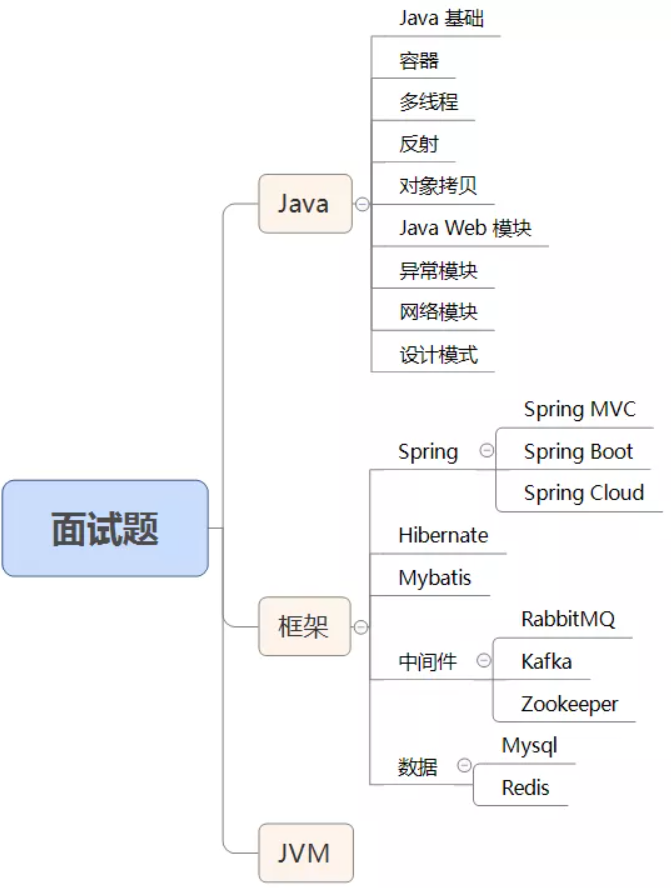

::: info 声明

此份面试题来自知乎[java经验总结](https://www.zhihu.com/question/27858692/answer/787505434) ，原文参考答案比较浅显且部分有误，目前已对部分参考答案进行订正、补充。

提示：此份面试题在学完相关基础后食用效果最佳，可以快速查缺补漏，加深对知识的理解。切忌死记硬背，编程重在理解思想和代码编写

:::

<!-- more -->

## 一. 面试题模块介绍

这份面试题，包含的内容了十九了模块：Java 基础、容器、多线程、反射、对象拷贝、Java Web 模块、异常、网络、设计模式、Spring/Spring MVC、Spring Boot/Spring Cloud、Hibernate、Mybatis、RabbitMQ、Kafka、Zookeeper、MySql、Redis、JVM 。如下图所示：

可能对于初学者不需要看后面的框架和 JVM 模块的知识，读者朋友们可根据自己的情况，选择对应的模块进行阅读。

## 二. 适宜阅读人群

- 需要面试的初/中/高级 java 程序员
- 想要查漏补缺的人
- 想要不断完善和扩充自己 java 技术栈的人
- java 面试官

## 三. 具体面试题

::: tip (一)、Java基础

 

:::

1.JDK和JRE有什么区别?

2.==和equals的区别是什么?

3.两个对象的 hashCode()相同，则equals()也一定为true，对吗?

4.final在java中有什么作用?

5.java中的 Math.round(-1.5)等于多少?

6.String 属于基础的数据类型吗?

7.java 中操作字符串都有哪些类?它们之间有什么区别?

8.String str="i"与String str=new String("i")一样吗?

9.如何将字符串反转?

10.String类的常用方法都有那些?

11.抽象类必须要有抽象方法吗?

12.普通类和抽象类有哪些区别?

13.抽象类能使用final 修饰吗?

14.接口和抽象类有什么区别?

15.java中IO流分为几种?

16.BIO、NIO、AIO有什么区别

17.Files的常用方法有哪些？

::: right

[参考答案](模块01—Java基础.md)

:::

****

::: tip （二）、容器

 

:::

18.java容器都有哪些?

19.Collection和Collections有什么区别?

20.List、Set、Map 之间的区别是什么?

21.HashMap和Hashtable有什么区别?

22.如何决定使用HashMap还是TreeMap?

23.说一下HashMap 的实现原理?

24.说一下 HashSet 的实现原理?

25.ArrayList和LinkedList的区别是什么?

26.如何实现数组和List 之间的转换?

27.ArrayList和Vector 的区别是什么?

28.Array和ArrayList有何区别?

29.在 Queue 中 poll()和remove()有什么区别?

30.哪些集合类是线程安全的?

31.迭代器lterator 是什么?

32.lterator怎么使用?有什么特点?

33.lterator和Listlterator有什么区别? 

34.怎么确保一个集合不能被修改？

::: right

[参考答案](模块02—Java集合.md)

:::

****

::: tip （三）、多线程

 

:::

35.并行和并发有什么区别?

36.线程和进程的区别?

37.守护线程是什么?

38.创建线程有哪几种方式?

39.说一下runnable和callable有什么区别?

40.线程有哪些状态?

41.sleep()和wait()有什么区别?

42.notify()和 notifyAll)有什么区别?

43.线程的run()和start()有什么区别?

44.创建线程池有哪几种方式?

 45.线程池都有哪些状态?

46.线程池中 submit()和execute()方法有什么区别?

47.在java程序中怎么保证多线程的运行安全?

48.多线程锁的升级原理是什么?

49.什么是死锁?

50.怎么防止死锁?

51.ThreadLocal是什么?有哪些使用场景?

52.说一下synchronized底层实现原理?

53.synchronized和volatile 的区别是什么?

54.synchronized和Lock有什么区别?

55.synchronized和ReentrantLock区别是什么?

56.说一下atomic 的原理?

****

::: tip （四）、反射

 

:::

57.什么是反射?

58.什么是java序列化?什么情况下需要序列化?

59.动态代理是什么?有哪些应用?

60.怎么实现动态代理?

****

::: tip （五）、对象拷贝

 

:::

61.为什么要使用克隆?

62.如何实现对象克隆?

63.深拷贝和浅拷贝区别是什么?

****

::: tip （六）、Java Web

 

:::

64.jsp和servlet有什么区别?

65.jsp有哪些内置对象?作用分别是什么?

66.说一下jsp的4种作用域?

67.session和cookie有什么区别?

68.说一下 session的工作原理?

69.如果客户端禁止 cookie 能实现session 还能用吗?

70.spring mvc和struts 的区别是什么?

71.如何避免 sql注入?

72.什么是XSS攻击,如何避免?

73.什么是CSRF攻击，如何避免?

****

::: tip （七）、异常

 

:::

74.throw和throws 的区别?

75.final、finally、finalize有什么区别?

76.try-catch-finally 中哪个部分可以省略?

77.try-catch-finally中，如果catch 中 return 了, finally还会执行吗?78.常见的异常类有哪些?

***

::: tip （八）、网络

 

:::

79.http响应码301和302代表的是什么?有什么区别?

80.forward和redirect的区别?

81.简述tcp和udp的区别?

82.tcp为什么要三次握手，两次不行吗?为什么?

83.说一下 tcp粘包是怎么产生的?

84.OSl的七层模型都有哪些?

85.get和post请求有哪些区别?

86.如何实现跨域?

87.说一下JSONP 实现原理?

****

::: tip （九）、设计模式

 

:::

88.说一下你熟悉的设计模式?

89.简单工厂和抽象工厂有什么区别?

****

::: tip （十）.Spring/Spring MVC

 

:::

90.为什么要使用spring?

91.解释一下什么是aop?

9⒉.解释一下什么是ioc?

93.spring有哪些主要模块?

94.spring 常用的注入方式有哪些?

95.spring 中的 bean是线程安全的吗?

96.spring支持几种bean的作用域?

97.spring自动装配bean有哪些方式?

98.spring事务实现方式有哪些?

99.说一下spring 的事务隔离?

100.说一下spring mvc运行流程?

101.spring mvc有哪些组件?

102.@RequestMapping 的作用是什么?

103.@Autowired的作用是什么?

****

::: tip （十一）、Spring Boot/Spring Cloud

 

:::

104.什么是spring boot?

105.为什么要用spring boot?

106.spring boot核心配置文件是什么?

107.spring boot配置文件有哪几种类型?它们有什么区别?

108.spring boot有哪些方式可以实现热部署?

109.jpa和hibernate有什么区别?

110.什么是 spring cloud?

111.spring cloud 断路器的作用是什么?

112.spring cloud的核心组件有哪些?

****

::: tip （十二）、Hibernate

 

:::

113.为什么要使用hibernate?

114.什么是 ORM框架?

115.hibernate 中如何在控制台查看打印的sql语句?

116.hibernate有几种查询方式?

117.hibernate 实体类可以被定义为final 吗?

118.在hibernate中使用Integer和int做映射有什么区别?

119.hibernate是如何工作的?

120.get()和load()的区别?

121.说一下 hibernate 的缓存机制?

122.hibernate对象有哪些状态?

123.在 hibernate 中 getCurrentSession和openSession的区别是什么?

124.hibernate 实体类必须要有无参构造函数吗?为什么?

****

::: tip （十三）、Mybatis

 

:::

125.mybatis 中#{和$0的区别是什么?

126.mybatis有几种分页方式?

127.RowBounds是一次性查询全部结果吗?为什么?

128.mybatis逻辑分页和物理分页的区别是什么?

129.mybatis 是否支持延迟加载?延迟加载的原理是什么?

130.说一下mybatis的一级缓存和二级缓存?

131.mybatis 和 hibernate的区别有哪些?

132.mybatis有哪些执行器(Executor) ?

133.mybatis分页插件的实现原理是什么?

134.mybatis 如何编写一个自定义插件?

****

::: tip （十四）、RabbitMQ

 

:::

135.rabbitmq的使用场景有哪些?

136.rabbitmq有哪些重要的角色?

137.rabbitmq有哪些重要的组件?

138.rabbitmq中 vhost的作用是什么?

139.rabbitmq的消息是怎么发送的?

140.rabbitmq怎么保证消息的稳定性?

141.rabbitmq怎么避免消息丢失?

142.要保证消息持久化成功的条件有哪些?

143.rabbitmq持久化有什么缺点?

144.rabbitmq有几种广播类型?

145.rabbitmq怎么实现延迟消息队列?

146.rabbitmq集群有什么用?

147.rabbitmq节点的类型有哪些?

148.rabbitmq集群搭建需要注意哪些问题?

149.rabbitmq每个节点是其他节点的完整拷贝吗?为什么?

150.rabbitmq集群中唯—一个磁盘节点崩溃了会发生什么情况?

****

::: tip （十五）、Kafka

 

:::

152.kafka可以脱离zookeeper单独使用吗?为什么?

153.kafka有几种数据保留的策略?

154.kafka同时设置了7天和10G清除数据，到第五天的时候消息达到了10G，这个时候 kafka将如何处理?

155.什么情况会导致kafka运行变慢?

156.使用kafka集群需要注意什么?

****

::: tip （十六）、Zookeeper

 

:::

157.zookeeper是什么?

158.zookeeper都有哪些功能?

159.zookeeper有几种部署模式?

160.zookeeper怎么保证主从节点的状态同步?

161.集群中为什么要有主节点?

162.集群中有3台服务器，其中一个节点宕机，这个时候zookeeper还可以使用吗?

163.说一下zookeeper的通知机制?

****

::: tip （十七）.MySQL

 

:::

164.数据库的三范式是什么?

165.一张自增表里面总共有7条数据，删除了最后⒉条数据，重启 mysql数据库，又插入了一条数据，此时id是几?

166.如何获取当前数据库版本?

167.说一下ACID是什么?

168.char和varchar 的区别是什么?

169.float和double的区别是什么?

170.mysql 的内连接、左连接、右连接有什么区别?

171.mysql索引是怎么实现的?

172.怎么验证 mysql的索引是否满足需求?

173.说一下数据库的事务隔离?

174.说一下mysql常用的引擎?

175.说一下mysql的行锁和表锁?

176.说一下乐观锁和悲观锁?

177.mysql问题排查都有哪些手段?

178.如何做mysql的性能优化?

****

::: tip （十八）、Redis

 

:::

179.redis是什么?都有哪些使用场景?

180.redis有哪些功能?

181.redis和 memecache有什么区别?

182.redis为什么是单线程的?

183.什么是缓存穿透?怎么解决?

184.redis支持的数据类型有哪些?

185.redis支持的java客户端都有哪些?

186.jedis和redisson有哪些区别?

187.怎么保证缓存和数据库数据的一致性?

188.redis持久化有几种方式?

189.redis 怎么实现分布式锁?

190.redis分布式锁有什么缺陷?

191.redis如何做内存优化?

192.redis淘汰策略有哪些?

193.redis 常见的性能问题有哪些?该如何解决?

****

::: tip （十九）、JVM

 

:::

194.说一下 jvm的主要组成部分?及其作用?

195.说一下 jvm运行时数据区?

196.说一下堆栈的区别?

197.队列和栈是什么?有什么区别?

198.什么是双亲委派模型?

199.说一下类加载的执行过程?

200.怎么判断对象是否可以被回收?

201.java中都有哪些引用类型?

202.说一下 jvm有哪些垃圾回收算法?

203.说一下 jvm有哪些垃圾回收器?

204.详细介绍一下 CMS垃圾回收器?

205.新生代垃圾回收器和老生代垃圾回收器都有哪些?有什么区别?

206.简述分代垃圾回收器是怎么工作的?

207.说一下jvm调优的工具?

208.常用的jvm调优的参数都有哪些?
