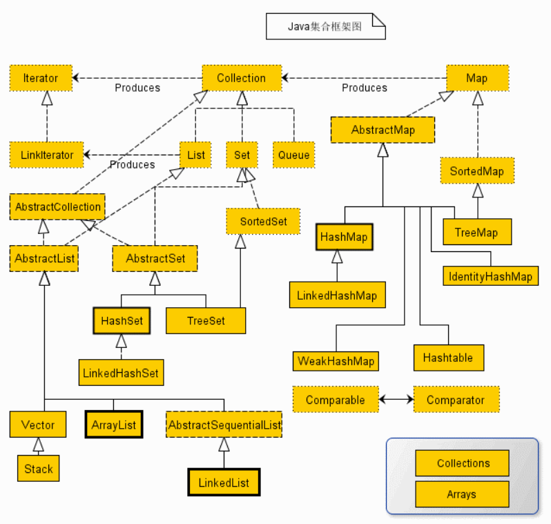

## 问题：

18.java容器都有哪些?

19.Collection和Collections有什么区别?

20.List、Set、Map 之间的区别是什么?

21.HashMap和Hashtable有什么区别?

22.如何决定使用HashMap还是TreeMap?

23.说一下HashMap 的实现原理?

24.说一下 HashSet 的实现原理?

25.ArrayList和LinkedList的区别是什么?

26.如何实现数组和List 之间的转换?

27.ArrayList和Vector 的区别是什么?

28.Array和ArrayList有何区别?

29.在 Queue 中 poll()和remove()有什么区别?

30.哪些集合类是线程安全的?

31.迭代器lterator 是什么?

32.lterator怎么使用?有什么特点?

33.lterator和Listlterator有什么区别? 

34.怎么确保一个集合不能被修改？


## 答案：

### 18.java容器都有哪些?




### 19.Collection和Collections有什么区别?

- java.util.Collection 是一个集合接口（集合类的一个顶级接口）。它提供了对集合对象进行基本操作的通用接口方法。Collection接口在Java 类库中有很多具体的实现。Collection接口的意义是为各种具体的集合提供了最大化的统一操作方式，其直接继承接口有List与Set。
- Collections则是集合类的一个工具类/帮助类，其中提供了一系列静态方法，用于对集合中元素进行排序、搜索以及线程安全等各种操作。


### 20.List、Set、Map 之间的区别是什么?


### 21.HashMap和Hashtable有什么区别?

- hashMap去掉了Hashtable 的contains方法，但是加上了containsValue（）和containsKey（）方法。
- Hashtable同步的，而HashMap是非同步的，效率上比Hashtable要高。
- hashMap允许空键值，而Hashtable不允许。


### 22.如何决定使用HashMap还是TreeMap?

对于在Map中插入、删除和定位元素这类操作，HashMap是最好的选择。

然而，假如你需要对一个有序的key集合进行遍历，TreeMap是更好的选择。基于你的collection的大小，也许向HashMap中添加元素

会更快，将map换为TreeMap进行有序key的遍历。


### 23.说一下HashMap 的实现原理?

**HashMap概述：** HashMap是基于哈希表的Map接口的非同步实现。此实现提供所有可选的映射操作，并允许使用null值和null键。此类不保证映射的顺序，特别是它不保证该顺序恒久不变。 

**HashMap的数据结构：** 在java编程语言中，最基本的结构就是两种，一个是数组，另外一个是模拟指针（引用），所有的数据结构都可以用这两个基本结构来构造的，HashMap也不例外。HashMap实际上是一个“链表散列”的数据结构，即数组和链表的结合体。

当我们往HashMap中put元素时,首先根据key的hashcode重新计算hash值,根据hash值得到这个元素在数组中的位置(下标),如果该数组在该位置上已经存放了其他元素,那么在这个位置上的元素将以链表的形式存放,新加入的放在链头,最先加入的放入链尾.如果数组中该位置没有元素,就直接将该元素放到数组的该位置上。

需要注意Jdk 1.8中对HashMap的实现做了优化,当链表中的节点数据超过**八个**之后,该链表会转为**红黑树**来提高查询效率,从原来的O(n)到O(logn)


### 24.说一下 HashSet 的实现原理?

- HashSet底层由HashMap实现

- HashSet的值存放于HashMap的key上

- HashMap的value统一为PRESENT

  

### 25.ArrayList和LinkedList的区别是什么?

最明显的区别是 ArrrayList底层的数据结构是数组，支持随机访问，而 LinkedList 的底层数据结构是双向循环链表，不支持随机访问。

使用下标访问一个元素，ArrayList 的时间复杂度是 O(1)，而 LinkedList 是 O(n)。


### 26.如何实现数组和List 之间的转换?

- List转换成为数组：调用ArrayList的toArray方法。

- 数组转换成为List：调用Arrays的asList方法。

  

### 27.ArrayList和Vector 的区别是什么?

- Vector是同步的，而ArrayList不是。然而，如果你寻求在迭代的时候对列表进行改变，你应该使用CopyOnWriteArrayList。 

- ArrayList比Vector快，Vecto它因为有同步，不会过载。 ArrayList在多线程情况下可能会出现ConcurrentModificationException。

- ArrayList更加通用，因为我们可以使用Collections工具类轻易地获取同步列表和只读列表。

  

### 28.Array和ArrayList有何区别?

- Array可以容纳基本类型和对象，而ArrayList只能容纳对象。 

- Array是指定大小的，而ArrayList大小是固定的。 

- Array没有提供ArrayList那么多功能，比如addAll、removeAll和iterator等。

  

### 29.在 Queue 中 poll()和remove()有什么区别?

poll() 和 remove() 都是从队列中取出一个元素，但是 poll() 在获取元素失败的时候会返回空，但是 remove() 失败的时候会抛出异常。


### 30.哪些集合类是线程安全的?

- Vector：就比ArrayList多了个同步化机制（线程安全），因为效率较低，现在已经不太建议使用。在web应用中，特别是前台页面，往往效率（页面响应速度）是优先考虑的。

- statck：堆栈类，先进后出。

- Hashtable：就比HashMap多了个线程安全。

- Enumeration：枚举，相当于迭代器。

  

### 31.迭代器lterator 是什么?

迭代器是一种设计模式，它是一个对象，它可以遍历并选择序列中的对象，而开发人员不需要了解该序列的底层结构。迭代器通常被称

为“轻量级”对象，因为创建它的代价小。


### 32.lterator怎么使用?有什么特点?

Java中的Iterator功能比较简单，并且只能单向移动：

(1) 使用方法iterator()要求容器返回一个Iterator。第一次调用Iterator的next()方法时，它返回序列的第一个元素。注意：iterator()方法是java.lang.Iterable接口,被Collection继承。

(2) 使用next()获得序列中的下一个元素。

(3) 使用hasNext()检查序列中是否还有元素。

(4) 使用remove()将迭代器新返回的元素删除。

Iterator是Java迭代器最简单的实现，为List设计的ListIterator具有更多的功能，它可以从两个方向遍历List，也可以从List中插入和删除元素。


### 33.lterator和Listlterator有什么区别? 

- Iterator可用来遍历Set和List集合，但是ListIterator只能用来遍历List。 
- Iterator对集合只能是前向遍历，ListIterator既可以前向也可以后向。 
- ListIterator实现了Iterator接口，并包含其他的功能，比如：增加元素，替换元素，获取前一个和后一个元素的索引，等等。


### 34.怎么确保一个集合不能被修改？

可以使用 Collections. unmodifiableCollection(Collection c) 方法来创建一个只读集合，这样改变集合的任何操作都会抛出 Java. lang. 

UnsupportedOperationException 异常。

示例代码如下：

```java
List<String> list = new ArrayList<>();
list. add("A");
Collection<String> unmlist = Collections. unmodifiableCollection(list);
unmlist. add("B"); // 运行时此行报错
System. out. println(list.size());
```


