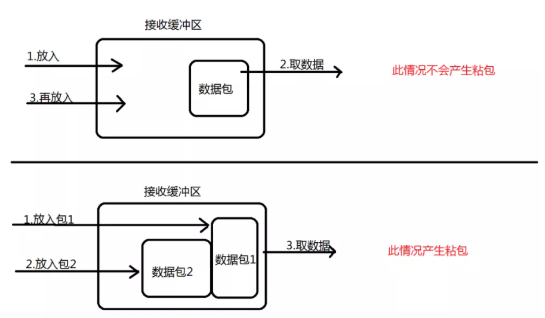

## 问题：

79.http响应码301和302代表的是什么?有什么区别?

80.forward和redirect的区别?

81.简述tcp和udp的区别?

82.tcp为什么要三次握手，两次不行吗?为什么?

83.说一下 tcp粘包是怎么产生的?

84.OSl的七层模型都有哪些?

85.get和post请求有哪些区别?

86.如何实现跨域?

87.说一下JSONP 实现原理?


## 答案：

### 79.http响应码301和302代表的是什么?有什么区别?

301，302 都是HTTP状态的编码，都代表着某个URL发生了转移。

**区别：**

- 301 redirect: 301 代表永久性转移(Permanently Moved)。

- 302 redirect: 302 代表暂时性转移(Temporarily Moved )。


### 80.forward和redirect的区别?

Forward和Redirect代表了两种请求转发方式：直接转发和间接转发。

**直接转发方式（Forward）**，客户端和浏览器只发出一次请求，Servlet、HTML、JSP或其它信息资源，由第二个信息资源响应该请求，在请求对象request中，保存的对象对于每个信息资源是共享的。

**间接转发方式（Redirect）**实际是两次HTTP请求，服务器端在响应第一次请求的时候，让浏览器再向另外一个URL发出请求，从而达到转发的目的。

**举个通俗的例子：**

直接转发就相当于：“A找B借钱，B说没有，B去找C借，借到借不到都会把消息传递给A”；

间接转发就相当于："A找B借钱，B说没有，让A去找C借"。


### 81.简述TCP和UDP的区别?

- TCP面向连接（如打电话要先拨号建立连接）;UDP是无连接的，即发送数据之前不需要建立连接。
- TCP提供可靠的服务。也就是说，通过TCP连接传送的数据，无差错，不丢失，不重复，且按序到达;UDP尽最大努力交付，即不保证可靠交付。
- TCP通过校验和，重传控制，序号标识，滑动窗口、确认应答实现可靠传输。如丢包时的重发控制，还可以对次序乱掉的分包进行顺序控制。
- UDP具有较好的实时性，工作效率比TCP高，适用于对高速传输和实时性有较高的通信或广播通信。
- 每一条TCP连接只能是点到点的;UDP支持一对一，一对多，多对一和多对多的交互通信。
- TCP对系统资源要求较多，UDP对系统资源要求较少。


### 82.TCP为什么要三次握手，两次不行吗?为什么?

为了实现可靠数据传输， TCP 协议的通信双方， 都必须维护一个序列号， 以标识发送出去的数据包中， 哪些是已经被对方收到的。

三次握手的过程即是通信双方相互告知序列号起始值， 并确认对方已经收到了序列号起始值的必经步骤。

如果只是两次握手， 至多只有连接发起方的起始序列号能被确认， 另一方选择的序列号则得不到确认。


### 83.说一下 TCP粘包是怎么产生的?

**①. 发送方产生粘包**

采用TCP协议传输数据的客户端与服务器经常是保持一个长连接的状态（一次连接发一次数据不存在粘包），双方在连接不断开的情况下，可以一直传输数据；但当发送的数据包过于小的时候，那么TCP协议默认的会启用Nagle算法，将这些较小的数据包进行合并发送（缓冲区数据发送是一个堆压的过程）；这个合并过程就是在发送缓冲区中进行的，也就是说数据发送出来它已经是粘包的状态了。

> 
>

**②. 接收方产生粘包**

接收方采用TCP协议接收数据时的过程是这样的：数据到底接收方，从网络模型的下方传递至传输层，传输层的TCP协议处理是将其放置接收缓冲区，然后由应用层来主动获取（C语言用recv、read等函数）；这时会出现一个问题，就是我们在程序中调用的读取数据函数不能及时的把缓冲区中的数据拿出来，而下一个数据又到来并有一部分放入的缓冲区末尾，等我们读取数据时就是一个粘包。（放数据的速度 > 应用层拿数据速度）

> 
>


### 84.OSl的七层模型都有哪些?

**物联网淑慧示用**

1. 应用层：网络服务与最终用户的一个接口。
2. 表示层：数据的表示、安全、压缩。
3. 会话层：建立、管理、终止会话。
4. 传输层：定义传输数据的协议端口号，以及流控和差错校验。
5. 网络层：进行逻辑地址寻址，实现不同网络之间的路径选择。
6. 数据链路层：建立逻辑连接、进行硬件地址寻址、差错校验等功能。
7. 物理层：建立、维护、断开物理连接。


### 85.get和post请求有哪些区别?

- GET在浏览器回退时是无害的，而POST会再次提交请求。
- GET产生的URL地址可以被Bookmark，而POST不可以。
- GET请求会被浏览器主动cache，而POST不会，除非手动设置。
- GET请求只能进行url编码，而POST支持多种编码方式。
- GET请求参数会被完整保留在浏览器历史记录里，而POST中的参数不会被保留。
- GET请求在URL中传送的参数是有长度限制的，而POST么有。
- 对参数的数据类型，GET只接受ASCII字符，而POST没有限制。
- GET比POST更不安全，因为参数直接暴露在URL上，所以不能用来传递敏感信息。
- GET参数通过URL传递，POST放在Request body中。


### 86.如何实现跨域?


#### 方式一：图片ping或script标签跨域

**图片ping**常用于跟踪用户点击页面或动态广告曝光次数。 **script标签**可以得到从其他来源数据，这也是JSONP依赖的根据。


#### 方式二：JSONP跨域

JSONP（JSON with Padding）是数据格式JSON的一种“使用模式”，可以让网页从别的网域要数据。根据 XmlHttpRequest 对象受到同源策略的影响，而利用 `<script>`元素的这个开放策略，网页可以得到从其他来源动态产生的JSON数据，而这种使用模式就是所谓的 JSONP。用JSONP抓到的数据并不是JSON，而是任意的JavaScript，用 JavaScript解释器运行而不是用JSON解析器解析。所有通过Chrome查看所有JSONP发送的Get请求都是js类型，而非XHR。


#### 方式三：CORS

Cross-Origin Resource Sharing（CORS）跨域资源共享是一份浏览器技术的规范，提供了 Web 服务从不同域传来沙盒脚本的方法，以避开浏览器的同源策略，确保安全的跨域数据传输。现代浏览器使用CORS在API容器如XMLHttpRequest来减少HTTP请求的风险来源。与 JSONP 不同，CORS 除了 GET 要求方法以外也支持其他的 HTTP 要求。服务器一般需要增加如下响应头的一种或几种：

```html
Access-Control-Allow-Origin: *
Access-Control-Allow-Methods: POST, GET, OPTIONS
Access-Control-Allow-Headers: X-PINGOTHER, Content-Type
Access-Control-Max-Age: 86400
```

跨域请求默认不会携带Cookie信息，如果需要携带，请配置下述参数：

```html
"Access-Control-Allow-Credentials": true
// Ajax设置
"withCredentials": true
```


#### 方式四：window.name+iframe

`window.name`通过在iframe（一般动态创建）中加载跨域HTML文件来起作用。然后，HTML文件将传递给请求者的字符串内容赋值`window.name`。然后，请求者可以检索`window.name`值作为响应。

- iframe标签的跨域能力；
- `window.name`属性值在文档刷新后依旧存在的能力（且最大允许2M左右）。

每个iframe都有包裹它的window，而这个window是top window的子窗口。contentWindow属性返回`<iframe>`元素的Window对象。你可以使用这个Window对象来访问iframe的文档及其内部DOM。

```html
<!-- 
 下述用端口 
 10000表示：domainA
 10001表示：domainB
-->

<!-- localhost:10000 -->
<script>
  var iframe = document.createElement('iframe');
  iframe.style.display = 'none'; // 隐藏

  var state = 0; // 防止页面无限刷新
  iframe.onload = function() {
      if(state === 1) {
          console.log(JSON.parse(iframe.contentWindow.name));
          // 清除创建的iframe
          iframe.contentWindow.document.write('');
          iframe.contentWindow.close();
          document.body.removeChild(iframe);
      } else if(state === 0) {
          state = 1;
          // 加载完成，指向当前域，防止错误(proxy.html为空白页面)
          // Blocked a frame with origin "http://localhost:10000" from accessing a cross-origin frame.
          iframe.contentWindow.location = 'http://localhost:10000/proxy.html';
      }
  };

  iframe.src = 'http://localhost:10001';
  document.body.appendChild(iframe);
</script>

<!-- localhost:10001 -->
<!DOCTYPE html>
...
<script>
  window.name = JSON.stringify({a: 1, b: 2});
</script>
</html>
```


#### 方式五：window.postMessage()

HTML5新特性，可以用来向其他所有的 window 对象发送消息。需要注意的是我们必须要保证所有的脚本执行完才发送 MessageEvent，如果在函数执行的过程中调用了它，就会让后面的函数超时无法执行。

下述代码实现了跨域存储localStorage

```html
<!-- 
 下述用端口 
 10000表示：domainA
 10001表示：domainB
-->

<!-- localhost:10000 -->
<iframe src="http://localhost:10001/msg.html" name="myPostMessage" style="display:none;">
</iframe>

<script>
  function main() {
      LSsetItem('test', 'Test: ' + new Date());
      LSgetItem('test', function(value) {
          console.log('value: ' + value);
      });
      LSremoveItem('test');
  }

  var callbacks = {};
  window.addEventListener('message', function(event) {
      if (event.source === frames['myPostMessage']) {
          console.log(event)
          var data = /^#localStorage#(\d+)(null)?#([\S\s]*)/.exec(event.data);
          if (data) {
              if (callbacks[data[1]]) {
                  callbacks[data[1]](data[2] === 'null' ? null : data[3]);
              }
              delete callbacks[data[1]];
          }
      }
  }, false);

  var domain = '*';
  // 增加
  function LSsetItem(key, value) {
      var obj = {
          setItem: key,
          value: value
      };
      frames['myPostMessage'].postMessage(JSON.stringify(obj), domain);
  }
  // 获取
  function LSgetItem(key, callback) {
      var identifier = new Date().getTime();
      var obj = {
          identifier: identifier,
          getItem: key
      };
      callbacks[identifier] = callback;
      frames['myPostMessage'].postMessage(JSON.stringify(obj), domain);
  }
  // 删除
  function LSremoveItem(key) {
      var obj = {
          removeItem: key
      };
      frames['myPostMessage'].postMessage(JSON.stringify(obj), domain);
  }
</script>

<!-- localhost:10001 -->
<script>
  window.addEventListener('message', function(event) {
    console.log('Receiver debugging', event);
    if (event.origin == 'http://localhost:10000') {
      var data = JSON.parse(event.data);
      if ('setItem' in data) {
        localStorage.setItem(data.setItem, data.value);
      } else if ('getItem' in data) {
        var gotItem = localStorage.getItem(data.getItem);
        event.source.postMessage(
          '#localStorage#' + data.identifier +
          (gotItem === null ? 'null#' : '#' + gotItem),
          event.origin
        );
      } else if ('removeItem' in data) {
        localStorage.removeItem(data.removeItem);
      }
    }
  }, false);
</script>
```

注意Safari一下，会报错：

**Blocked a frame with origin “http://localhost:10001” from accessing a frame with origin “http://localhost:10000“. Protocols, domains, and ports must match.**

避免该错误，可以在Safari浏览器中勾选开发菜单==>停用跨域限制。或者只能使用服务器端转存的方式实现，因为Safari浏览器默认只支持CORS跨域请求。


#### 方式六：修改document.domain跨子域

前提条件：这两个域名必须属于同一个基础域名!而且所用的协议，端口都要一致，否则无法利用document.domain进行跨域，所以只能跨子域

在根域范围内，允许把domain属性的值设置为它的上一级域。例如，在”aaa.xxx.com”域内，可以把domain设置为 “xxx.com” 但不能设置为 “xxx.org” 或者”com”。

现在存在两个域名aaa.xxx.com和bbb.xxx.com。在aaa下嵌入bbb的页面，由于其document.name不一致，无法在aaa下操作bbb的js。可以在aaa和bbb下通过js将document.name = 'xxx.com';设置一致，来达到互相访问的作用。


#### 方式七：WebSocket

WebSocket protocol 是HTML5一种新的协议。它实现了浏览器与服务器全双工通信，同时允许跨域通讯，是server push技术的一种很棒的实现。相关文章，请查看：WebSocket、WebSocket-SockJS

需要注意：WebSocket对象不支持DOM 2级事件侦听器，必须使用DOM 0级语法分别定义各个事件。


#### 方式八：代理

同源策略是针对浏览器端进行的限制，可以通过服务器端来解决该问题

DomainA客户端（浏览器） ==> DomainA服务器 ==> DomainB服务器 ==> DomainA客户端（浏览器）


### 87.说一下JSONP 实现原理?

jsonp 即 json+padding，动态创建script标签，利用script标签的src属性可以获取任何域下的js脚本，通过这个特性(也可以说漏洞)，服务器端不在返回json格式，而是返回一段调用某个函数的js代码，在src中进行了调用，这样实现了跨域。

