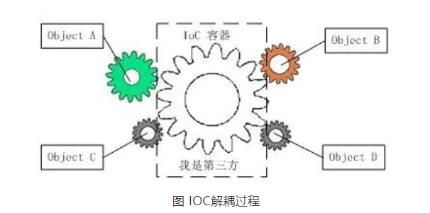
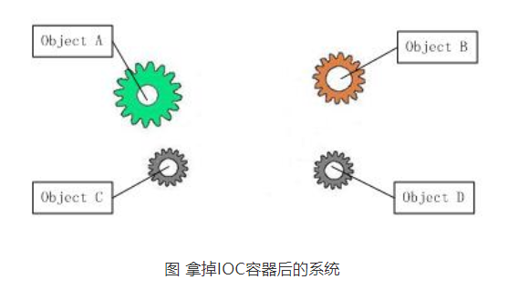

## 问题：

90.为什么要使用Spring?

91.解释一下什么是AOP?

92.解释一下什么是IoC?

93.Spring有哪些主要模块?

94.Spring 常用的注入方式有哪些?

95.Spring 中的 bean是线程安全的吗?

96.Spring支持几种bean的作用域?

97.Spring自动装配bean有哪些方式?

98.Spring事务实现方式有哪些?

99.说一下Spring 的事务隔离?

100.说一下Spring MVC运行流程?

101.Spring MVC有哪些组件?

102.@RequestMapping 的作用是什么?

103.@Autowired的作用是什么?


## 答案：

### 90.为什么要使用Spring?

**1.简介**

- 目的：解决企业应用开发的复杂性
- 功能：使用基本的JavaBean代替EJB，并提供了更多的企业应用功能
- 范围：任何Java应用

简单来说，Spring是一个轻量级的控制反转(IoC)和面向切面(AOP)的容器框架。

**2.轻量**　　

从大小与开销两方面而言Spring都是轻量的。完整的Spring框架可以在一个大小只有1MB多的 jar文件里发布。并且Spring所需的处理

开销也是微不足道的。此外，Spring是非侵入式的：典型地，Spring应用中的对象不依赖于Spring的特定类。

**3.控制反转**　　

Spring通过一种称作控制反转（IoC）的技术促进了松耦合。当应用了IoC，一个对象依赖的其它对象会通过被动的方式传递进来，而不

是这个对象自己创建或者查找依赖对象。你可以认为IoC与JNDI相反——不是对象从容器中查找依赖，而是容器在对象初始化时不等对

象请求就主动将依赖传递给它。

**4.面向切面**　　

Spring提供了面向切面编程的丰富支持，允许通过分离应用的业务逻辑与系统级服务（例如审计（auditing）和事务（transaction）管

理）进行内聚性的开发。应用对象只实现它们应该做的——完成业务逻辑——仅此而已。它们并不负责（甚至是意识）其它的系统级关

注点，例如日志或事务支持。

**5.容器**

Spring包含并管理应用对象的配置和生命周期，在这个意义上它是一种容器，你可以配置你的每个bean如何被创建——基于一个可配置

原型（prototype），你的bean可以创建一个单独的实例或者每次需要时都生成一个新的实例——以及它们是如何相互关联的。然而，

Spring不应该被混同于传统的重量级的EJB容器，它们经常是庞大与笨重的，难以使用。

**6.框架**

Spring可以将简单的组件配置、组合成为复杂的应用。在Spring中，应用对象被声明式地组合，典型地是在一个XML文件里。Spring也

提供了很多基础功能（事务管理、持久化框架集成等等），将应用逻辑的开发留给了你。所有Spring的这些特征使你能够编写更干净、

更可管理、并且更易于测试的代码。它们也为Spring中的各种模块提供了基础支持。

### 91.解释一下什么是AOP?

AOP（Aspect-Oriented Programming，面向方面编程），可以说是OOP（Object-Oriented Programing，面向对象编程）的补充和完善。OOP引入封装、继承和多态性等概念来建立一种对象层次结构，用以模拟公共行为的一个集合。当我们需要为分散的对象引入公共行为的时候，OOP则显得无能为力。也就是说，OOP允许你定义从上到下的关系，但并不适合定义从左到右的关系。例如日志功能。日志代码往往水平地散布在所有对象层次中，而与它所散布到的对象的核心功能毫无关系。对于其他类型的代码，如安全性、异常处理和透明的持续性也是如此。这种散布在各处的无关的代码被称为横切（cross-cutting）代码，在OOP设计中，它导致了大量代码的重复，而不利于各个模块的重用。


而AOP技术则恰恰相反，它利用一种称为“横切”的技术，剖解开封装的对象内部，并将那些影响了多个类的公共行为封装到一个可重用模块，并将其名为“Aspect”，即方面。所谓“方面”，简单地说，就是将那些与业务无关，却为业务模块所共同调用的逻辑或责任封装起来，便于减少系统的重复代码，降低模块间的耦合度，并有利于未来的可操作性和可维护性。AOP代表的是一个横向的关系，如果说“对象”是一个空心的圆柱体，其中封装的是对象的属性和行为；那么面向方面编程的方法，就仿佛一把利刃，将这些空心圆柱体剖开，以获得其内部的消息。而剖开的切面，也就是所谓的“方面”了。然后它又以巧夺天功的妙手将这些剖开的切面复原，不留痕迹。


使用“横切”技术，AOP把软件系统分为两个部分：核心关注点和横切关注点。业务处理的主要流程是核心关注点，与之关系不大的部分是横切关注点。横切关注点的一个特点是，他们经常发生在核心关注点的多处，而各处都基本相似。比如权限认证、日志、事务处理。Aop 的作用在于分离系统中的各种关注点，将核心关注点和横切关注点分离开来。正如Avanade公司的高级方案构架师Adam Magee所说，AOP的核心思想就是“将应用程序中的商业逻辑同对其提供支持的通用服务进行分离。”


### 92.解释一下什么是IoC?

IOC是Inversion of Control的缩写，多数书籍翻译成“控制反转”。

1996年，Michael Mattson在一篇有关探讨面向对象框架的文章中，首先提出了IOC 这个概念。对于面向对象设计及编程的基本思想，前面我们已经讲了很多了，不再赘述，简单来说就是把复杂系统分解成相互合作的对象，这些对象类通过封装以后，内部实现对外部是透明的，从而降低了解决问题的复杂度，而且可以灵活地被重用和扩展。

IOC理论提出的观点大体是这样的：借助于“第三方”实现具有依赖关系的对象之间的解耦。如下图：



大家看到了吧，由于引进了中间位置的“第三方”，也就是IOC容器，使得A、B、C、D这4个对象没有了耦合关系，齿轮之间的传动全部依靠“第三方”了，全部对象的控制权全部上缴给“第三方”IOC容器，所以，IOC容器成了整个系统的关键核心，它起到了一种类似“粘合剂”的作用，把系统中的所有对象粘合在一起发挥作用，如果没有这个“粘合剂”，对象与对象之间会彼此失去联系，这就是有人把IOC容器比喻成“粘合剂”的由来。

我们再来做个试验：把上图中间的IOC容器拿掉，然后再来看看这套系统：



我们现在看到的画面，就是我们要实现整个系统所需要完成的全部内容。这时候，A、B、C、D这4个对象之间已经没有了耦合关系，彼

此毫无联系，这样的话，当你在实现A的时候，根本无须再去考虑B、C和D了，对象之间的依赖关系已经降低到了最低程度。所以，如

果真能实现IOC容器，对于系统开发而言，这将是一件多么美好的事情，参与开发的每一成员只要实现自己的类就可以了，跟别人没有

任何关系！

 

**我们再来看看，控制反转(IOC)到底为什么要起这么个名字？我们来对比一下：**

软件系统在没有引入IOC容器之前，如图1所示，对象A依赖于对象B，那么对象A在初始化或者运行到某一点的时候，自己必须主动去创建对象B或者使用已经创建的对象B。无论是创建还是使用对象B，控制权都在自己手上。

软件系统在引入IOC容器之后，这种情形就完全改变了，如图3所示，由于IOC容器的加入，对象A与对象B之间失去了直接联系，所以，当对象A运行到需要对象B的时候，IOC容器会主动创建一个对象B注入到对象A需要的地方。

通过前后的对比，我们不难看出来：对象A获得依赖对象B的过程,由主动行为变为了被动行为，控制权颠倒过来了，这就是“控制反转”这个名称的由来。


### 93.Spring有哪些主要模块?

Spring框架至今已集成了20多个模块。这些模块主要被分如下图所示的核心容器、数据访问/集成,、Web、AOP（面向切面编程）、工

具、消息和测试模块。


### 94.Spring 常用的注入方式有哪些?

Spring通过DI（依赖注入）实现IOC（控制反转），常用的注入方式主要有三种：

1. 构造方法注入
2. setter注入
3. 基于注解的注入


### 95.Spring 中的 bean是线程安全的吗?

Spring容器中的Bean是否线程安全，容器本身并没有提供Bean的线程安全策略，因此可以说spring容器中的Bean本身不具备线程安全

的特性，但是具体还是要结合具体scope的Bean去研究。


### 96.Spring支持几种bean的作用域?

当通过spring容器创建一个Bean实例时，不仅可以完成Bean实例的实例化，还可以为Bean指定特定的作用域。Spring支持如下5种作用域：

- **singleton：**单例模式，在整个Spring IoC容器中，使用singleton定义的Bean将只有一个实例
- **prototype：**原型模式，每次通过容器的getBean方法获取prototype定义的Bean时，都将产生一个新的Bean实例
- **request：**对于每次HTTP请求，使用request定义的Bean都将产生一个新实例，即每次HTTP请求将会产生不同的Bean实例。只有在Web应用中使用Spring时，该作用域才有效
- **session：**对于每次HTTP Session，使用session定义的Bean豆浆产生一个新实例。同样只有在Web应用中使用Spring时，该作用域才有效
- **globalsession：**每个全局的HTTP Session，使用session定义的Bean都将产生一个新实例。典型情况下，仅在使用portlet context的时候有效。同样只有在Web应用中使用Spring时，该作用域才有效

其中比较常用的是singleton和prototype两种作用域。对于singleton作用域的Bean，每次请求该Bean都将获得相同的实例。容器负责跟踪Bean实例的状态，负责维护Bean实例的生命周期行为；如果一个Bean被设置成prototype作用域，程序每次请求该id的Bean，Spring都会新建一个Bean实例，然后返回给程序。在这种情况下，Spring容器仅仅使用new 关键字创建Bean实例，一旦创建成功，容器不在跟踪实例，也不会维护Bean实例的状态。

如果不指定Bean的作用域，Spring默认使用singleton作用域。Java在创建Java实例时，需要进行内存申请；销毁实例时，需要完成垃圾回收，这些工作都会导致系统开销的增加。因此，prototype作用域Bean的创建、销毁代价比较大。而singleton作用域的Bean实例一旦创建成功，可以重复使用。因此，除非必要，否则尽量避免将Bean被设置成prototype作用域。


### 97.Spring自动装配bean有哪些方式?

Spring容器负责创建应用程序中的bean同时通过ID来协调这些对象之间的关系。作为开发人员，我们需要告诉Spring要创建哪些bean并且如何将其装配到一起。

spring中bean装配有两种方式：

- 隐式的bean发现机制和自动装配
- 在java代码或者XML中进行显示配置

当然这些方式也可以配合使用。


### 98.Spring事务实现方式有哪些?

1. 编程式事务管理对基于 POJO 的应用来说是唯一选择。我们需要在代码中调用beginTransaction()、commit()、rollback()等事务管理相关的方法，这就是编程式事务管理。
2. 基于 TransactionProxyFactoryBean 的声明式事务管理
3. 基于 @Transactional 的声明式事务管理
4. 基于 Aspectj AOP 配置事务


### 99.说一下Spring 的事务隔离?

事务隔离级别指的是一个事务对数据的修改与另一个并行的事务的隔离程度，当多个事务同时访问相同数据时，如果没有采取必要的隔离机制，就可能发生以下问题：

- 脏读：一个事务读到另一个事务未提交的更新数据。
- 幻读：例如第一个事务对一个表中的数据进行了修改，比如这种修改涉及到表中的“全部数据行”。同时，第二个事务也修改这个表中的数据，这种修改是向表中插入“一行新数据”。那么，以后就会发生操作第一个事务的用户发现表中还存在没有修改的数据行，就好象发生了幻觉一样。
- 不可重复读：比方说在同一个事务中先后执行两条一模一样的select语句，期间在此次事务中没有执行过任何DDL语句，但先后得到的结果不一致，这就是不可重复读。


### 100.说一下Spring MVC运行流程?

**Spring MVC运行流程图：**


**Spring运行流程描述：**

1. 用户向服务器发送请求，请求被Spring 前端控制Servelt DispatcherServlet捕获；

2. DispatcherServlet对请求URL进行解析，得到请求资源标识符（URI）。然后根据该URI，调用HandlerMapping获得该Handler配置的所有相关的对象（包括Handler对象以及Handler对象对应的拦截器），最后以HandlerExecutionChain对象的形式返回；

3. DispatcherServlet 根据获得的Handler，选择一个合适的HandlerAdapter；（附注：如果成功获得HandlerAdapter后，此时将开始执行拦截器的preHandler(...)方法）

4. 提取Request中的模型数据，填充Handler入参，开始执行Handler（Controller)。 在填充Handler的入参过程中，根据你的配置，Spring将帮你做一些额外的工作：
   - HttpMessageConveter： 将请求消息（如Json、xml等数据）转换成一个对象，将对象转换为指定的响应信息
   - 数据转换：对请求消息进行数据转换。如String转换成Integer、Double等
   - 数据根式化：对请求消息进行数据格式化。 如将字符串转换成格式化数字或格式化日期等
   - 数据验证： 验证数据的有效性（长度、格式等），验证结果存储到BindingResult或Error中

5. Handler执行完成后，向DispatcherServlet 返回一个ModelAndView对象；

6. 根据返回的ModelAndView，选择一个适合的ViewResolver（必须是已经注册到Spring容器中的ViewResolver)返回给DispatcherServlet ；

7. ViewResolver 结合Model和View，来渲染视图；

8. 将渲染结果返回给客户端。


### 101.Spring MVC有哪些组件?

Spring MVC的核心组件：

1. DispatcherServlet：中央控制器，把请求给转发到具体的控制类
2. Controller：具体处理请求的控制器
3. HandlerMapping：映射处理器，负责映射中央处理器转发给controller时的映射策略
4. ModelAndView：服务层返回的数据和视图层的封装类
5. ViewResolver：视图解析器，解析具体的视图
6. Interceptors ：拦截器，负责拦截我们定义的请求然后做处理工作


### 102.@RequestMapping 的作用是什么?

RequestMapping是一个用来处理请求地址映射的注解，可用于类或方法上。用于类上，表示类中的所有响应请求的方法都是以该地址作为父路径。

RequestMapping注解有六个属性，下面我们把它分成三类进行说明。

**value， method：**

- value：指定请求的实际地址，指定的地址可以是URI Template 模式（后面将会说明）；
- method：指定请求的method类型， GET、POST、PUT、DELETE等；

**consumes，produces**

- consumes：指定处理请求的提交内容类型（Content-Type），例如application/json, text/html；
- produces：指定返回的内容类型，仅当request请求头中的(Accept)类型中包含该指定类型才返回；

**params，headers**

- params： 指定request中必须包含某些参数值是，才让该方法处理。
- headers：指定request中必须包含某些指定的header值，才能让该方法处理请求。


### 103.@Autowired的作用是什么?

@Autowired 是一个注解，它可以对类成员变量、方法及构造函数进行标注，让 spring 完成 bean 自动装配的工作。

@Autowired 默认是按照类去匹配，配合 @Qualifier 指定按照名称去装配 bean。

常见用法

```java
import org.springframework.beans.factory.annotation.Autowired;
import org.springframework.stereotype.Controller;
 
import blog.service.ArticleService;
import blog.service.TagService;
import blog.service.TypeService;
 
@Controller
public class TestController {
 
	//成员属性字段使用 @Autowired，无需字段的 set 方法
	@Autowired
	private TypeService typeService;
	
	
	//set 方法使用 @Autowired
	private ArticleService articleService;
	@Autowired
	public void setArticleService(ArticleService articleService) {
		this.articleService = articleService;
	}
 
	//构造方法使用 @Autowired
	private TagService tagService;
	@Autowired
	public TestController(TagService tagService) {
		this.tagService = tagService; 
	}
	
}
```

