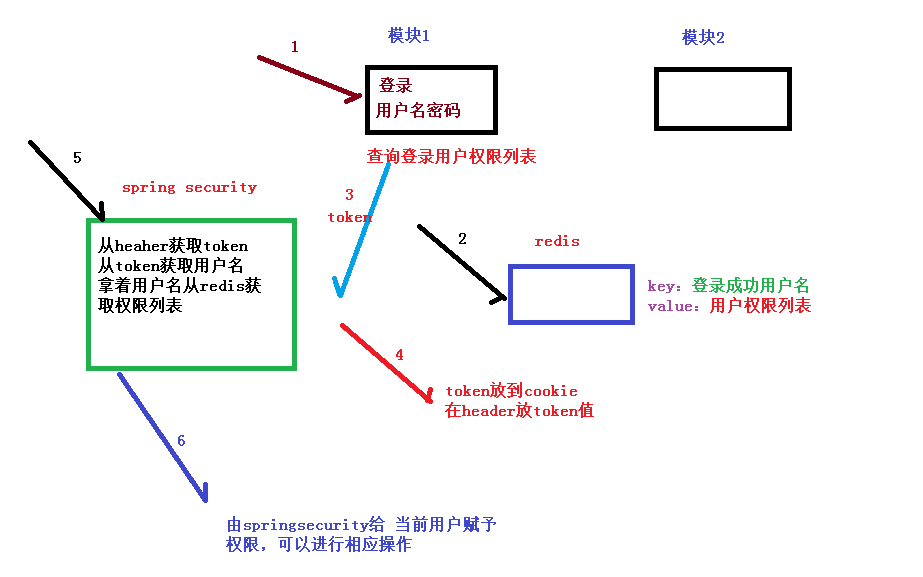
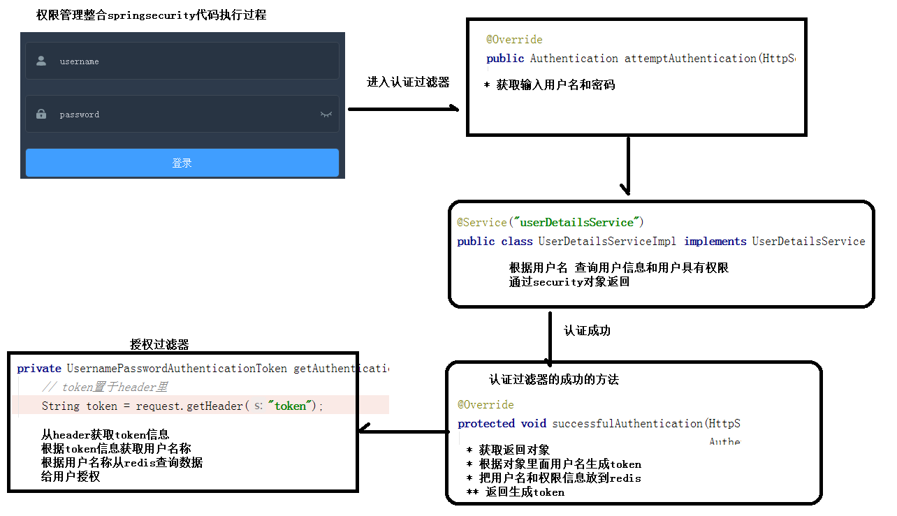

# Spring Security

## 一、框架介绍

Spring 是一个非常流行和成功的 Java 应用开发框架。Spring Security 基于 Spring 框架，提供了一套 Web 应用安全性的完整解决方案。一般来说，Web 应用的安全性包括**用户认证（Authentication）和用户授权（Authorization）**两个部分。

（1）用户认证指的是：验证某个用户是否为系统中的合法主体，也就是说用户能否访问该系统。用户认证一般要求用户提供用户名和密码。系统通过校验用户名和密码来完成认证过程。

（2）用户授权指的是验证某个用户是否有权限执行某个操作。在一个系统中，不同用户所具有的权限是不同的。比如对一个文件来说，有的用户只能进行读取，而有的用户可以进行修改。一般来说，系统会为不同的用户分配不同的角色，而每个角色则对应一系列的权限。

**Spring Security其实就是用filter，对多请求的路径进行过滤。**

（1）如果是基于Session，那么Spring Security会对cookie里的sessionid进行解析，找到服务器存储的sesion信息，然后判断当前用户是否符合请求的要求。

（2）如果是token，则是解析出token，然后将当前请求加入到Spring Security管理的权限信息中去

## 二、认证与授权实现思路

如果系统的模块众多，每个模块都需要进行授权与认证，可以选择基于token的形式进行授权与认证，用户根据用户名密码认证成功，然后获取当前用户角色的一系列权限值，并以用户名为key，权限列表为value的形式存入redis缓存中，根据用户名相关信息生成token返回，浏览器将token记录到cookie中，每次调用api接口都默认将token携带到header请求头中，Spring Security解析header头获取token信息，解析token获取当前用户名，根据用户名就可以从redis中获取权限列表，这样Spring Security就能够判断当前请求是否有权限访问。

流程图：

代码执行过程：

