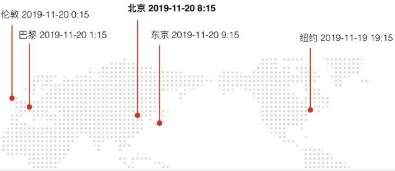
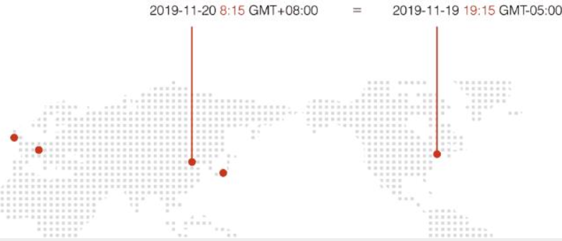
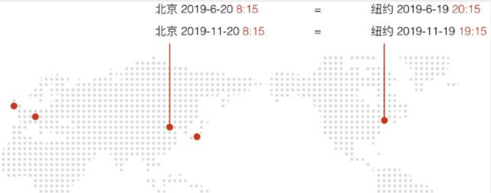
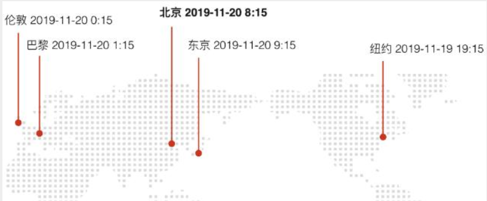

## 一、基本概念

在计算机中，我们经常需要处理日期和时间。

这是日期：

- 2019-11-20
- 2020-1-1

这是时间：

- 12:30:59
- 2020-1-1 20:21:59

日期是指某一天，它不是连续变化的，而是应该被看成离散的。

而时间有两种概念，一种是不带日期的时间，例如，12:30:59。另一种是带日期的时间，例如，2020-1-1 20:21:59，只有这种带日期的时间能唯一确定某个时刻，不带日期的时间是无法确定一个唯一时刻的。

### （一）本地时间

当我们说当前时刻是2019年11月20日早上8:15的时候，我们说的实际上是本地时间。在国内就是北京时间。在这个时刻，如果地球上不同地方的人们同时看一眼手表，他们各自的本地时间是不同的：



所以，不同的时区，在同一时刻，本地时间是不同的。全球一共分为24个时区，伦敦所在的时区称为标准时区，其他时区按东／西偏移的小时区分，北京所在的时区是东八区。

### （二）时区

因为光靠本地时间还无法唯一确定一个准确的时刻，所以我们还需要给本地时间加上一个时区。时区有好几种表示方式。

一种是以`GMT`或者`UTC`加时区偏移表示，例如：`GMT+08:00`或者`UTC+08:00`表示东八区。

`GMT`和`UTC`可以认为基本是等价的，只是`UTC`使用更精确的原子钟计时，每隔几年会有一个闰秒，我们在开发程序的时候可以忽略两者的误差，因为计算机的时钟在联网的时候会自动与时间服务器同步时间。

另一种是缩写，例如，`CST`表示`China Standard Time`，也就是中国标准时间。但是`CST`也可以表示美国中部时间`Central Standard Time USA`，因此，缩写容易产生混淆，我们尽量不要使用缩写。

最后一种是以洲／城市表示，例如，`Asia/Shanghai`，表示上海所在地的时区。特别注意城市名称不是任意的城市，而是由国际标准组织规定的城市。

因为时区的存在，东八区的2019年11月20日早上8:15，和西五区的2019年11月19日晚上19:15，他们的时刻是相同的：



时刻相同的意思就是，分别在两个时区的两个人，如果在这一刻通电话，他们各自报出自己手表上的时间，虽然本地时间是不同的，但是这两个时间表示的时刻是相同的。

### （三）夏令时

时区还不是最复杂的，更复杂的是夏令时。所谓夏令时，就是夏天开始的时候，把时间往后拨1小时，夏天结束的时候，再把时间往前拨1小时。我们国家实行过一段时间夏令时，1992年就废除了，但是矫情的美国人到现在还在使用，所以时间换算更加复杂。



因为涉及到夏令时，相同的时区，如果表示的方式不同，转换出的时间是不同的。我们举个栗子：

对于2019-11-20和2019-6-20两个日期来说，假设北京人在纽约：

- 如果以`GMT`或者`UTC`作为时区，无论日期是多少，时间都是`19:00`；
- 如果以国家／城市表示，例如`America／NewYork`，虽然纽约也在西五区，但是，因为夏令时的存在，在不同的日期，`GMT`时间和纽约时间可能是不一样的：

| 时区             | 2019-11-20 | 2019-6-20 |
| :--------------- | :--------- | :-------- |
| GMT-05:00        | 19:00      | 19:00     |
| UTC-05:00        | 19:00      | 19:00     |
| America/New_York | 19:00      | 20:00     |

实行夏令时的不同地区，进入和退出夏令时的时间很可能是不同的。同一个地区，根据历史上是否实行过夏令时，标准时间在不同年份换算成当地时间也是不同的。因此，计算夏令时，没有统一的公式，必须按照一组给定的规则来算，并且，该规则要定期更新。

 计算夏令时请使用标准库提供的相关类，不要试图自己计算夏令时。

### （四）本地化

在计算机中，通常使用`Locale`表示一个国家或地区的日期、时间、数字、货币等格式。`Locale`由`语言_国家`的字母缩写构成，例如，`zh_CN`表示中文+中国，`en_US`表示英文+美国。语言使用小写，国家使用大写。

对于日期来说，不同的Locale，例如，中国和美国的表示方式如下：

- zh_CN：2016-11-30
- en_US：11/30/2016

计算机用`Locale`在日期、时间、货币和字符串之间进行转换。一个电商网站会根据用户所在的`Locale`对用户显示如下：

|          | 中国用户   | 美国用户   |
| :------- | :--------- | :--------- |
| 购买价格 | 12000.00   | 12,000.00  |
| 购买日期 | 2016-11-30 | 11/30/2016 |

::: tip 小结

在编写日期和时间的程序前，我们要准确理解日期、时间和时刻的概念。

由于存在本地时间，我们需要理解时区的概念，并且必须牢记由于夏令时的存在，同一地区用`GMT/UTC`和城市表示的时区可能导致时间不同。

计算机通过`Locale`来针对当地用户习惯格式化日期、时间、数字、货币等。

:::

## 二、日期和时间的存储与表示

**在计算机中，应该如何表示日期和时间呢？**

我们经常看到的日期和时间表示方式如下：

- 2019-11-20 0:15:00 GMT+00:00
- 2019年11月20日8:15:00
- 11/19/2019 19:15:00 America/New_York

如果直接以字符串的形式存储，那么不同的格式，不同的语言会让表示方式非常繁琐。

在理解日期和时间的表示方式之前，我们先要理解数据的存储和展示。

当我们定义一个整型变量并赋值时：

```java
int n = 123400;
```

编译器会把上述字符串（程序源码就是一个字符串）编译成字节码。在程序的运行期，变量`n`指向的内存实际上是一个4字节区域：

```ascii
┌──┬──┬──┬──┐
│00│01│e2│08│
└──┴──┴──┴──┘
```

注意到计算机内存除了二进制的`0`/`1`外没有其他任何格式。上述十六进制是为了简化表示。（回顾计算机组成原理）

当我们用`System.out.println(n)`打印这个整数的时候，实际上`println()`这个方法在内部把`int`类型转换成`String`类型，然后打印出字符串`123400`。

类似的，我们也可以以十六进制的形式打印这个整数，或者，如果`n`表示一个价格，我们就以`$123,400.00`的形式来打印它：

```java
import java.text.*; 
import java.util.*; 
public class Main {
    public static void main(String[] args) {
        int n = 123400;
        // 123400
        System.out.println(n);
        // 1e208
        System.out.println(Integer.toHexString(n));
        // $123,400.00
        System.out.println(NumberFormat.getCurrencyInstance(Locale.US).format(n));
    }
}
```

可见，整数`123400`是数据的存储格式，它的存储格式非常简单。而我们打印的各种各样的字符串，则是数据的展示格式。展示格式有多种形式，但本质上它就是一个转换方法：

```java
String toDisplay(int n) { ... }
```

理解了数据的存储和展示，我们回头看看以下几种日期和时间：

- 2019-11-20 0:15:01 GMT+00:00
- 2019年11月20日8:15:01
- 11/19/2019 19:15:01 America/New_York

它们实际上是数据的展示格式，分别按英国时区、中国时区、纽约时区对同一个时刻进行展示。而这个“同一个时刻”在计算机中存储的本质上只是一个整数，我们称它为`Epoch Time`。

`Epoch Time`是计算从1970年1月1日零点（格林威治时区／GMT+00:00）到现在所经历的秒数，例如：

`1574208900`表示从从1970年1月1日零点GMT时区到该时刻一共经历了1574208900秒，换算成伦敦、北京和纽约时间分别是：

```
1574208900 = 北京时间2019-11-20 8:15:00
           = 伦敦时间2019-11-20 0:15:00
           = 纽约时间2019-11-19 19:15:00
```



因此，在计算机中，只需要存储一个整数`1574208900`表示某一时刻。当需要显示为某一地区的当地时间时，我们就把它格式化为一个字符串：

```
String displayDateTime(int n, String timezone) { ... }
```

`Epoch Time`又称为 ==时间戳== ，在不同的编程语言中，会有几种存储方式：

- 以秒为单位的整数：1574208900，缺点是精度只能到秒；
- 以毫秒为单位的整数：1574208900123，最后3位表示毫秒数；
- 以秒为单位的浮点数：1574208900.123，小数点后面表示零点几秒。

它们之间转换非常简单。而在Java程序中，时间戳通常是用`long`表示的毫秒数，即：

```java
long t = 1574208900123L;
```

转换成北京时间就是`2019-11-20T8:15:00.123`。要获取当前时间戳，可以使用`System.currentTimeMillis()`，这是Java程序获取时间戳最常用的方法。

## 三、标准库API

我们再来看一下Java标准库提供的API。Java标准库有两套处理日期和时间的API：

- 一套定义在`java.util`这个包里面，主要包括`Date`、`Calendar`和`TimeZone`这几个类；
- 一套新的API是在Java 8引入的，定义在`java.time`这个包里面，主要包括`LocalDateTime`、`ZonedDateTime`、`ZoneId`等。

为什么会有新旧两套API呢？因为历史遗留原因，旧的API存在很多问题，所以引入了新的API。

那么我们能不能跳过旧的API直接用新的API呢？如果涉及到遗留代码就不行，因为很多遗留代码仍然使用旧的API，所以目前仍然需要对旧的API有一定了解，很多时候还需要在新旧两种对象之间进行转换。

### （一）旧API的常用类型和方法

> #### 1、Date

`java.util.Date`是用于表示一个日期和时间的对象，注意与`java.sql.Date`区分，后者用在数据库中。如果观察Date的源码，可以发现它实际上存储了一个long类型的以毫秒表示的时间戳：

```java
public class Date implements Serializable, Cloneable, Comparable<Date> {

    private transient long fastTime;

    ...
}
```

Date的基本用法：

```java
public class Main {
    public static void main(String[] args) {
        // 获取当前时间:
        Date date = new Date();
        System.out.println(date.getYear() + 1900); // 必须加上1900
        System.out.println(date.getMonth() + 1); // 0~11，必须加上1
        System.out.println(date.getDate()); // 1~31，不能加1
        // 转换为String:
        System.out.println(date.toString());
        // 转换为GMT时区:
        System.out.println(date.toGMTString());
        // 转换为本地时区:
        System.out.println(date.toLocaleString());
    }
}
```

::: info 注意点

- `getYear()`返回的年份必须加上`1900`;
- `getMonth()`返回的月份是`0`\~`11`分别表示1\~12月，所以要加1;
- `getDate()`返回的日期范围是`1`~`31`，又不能加1。

:::

打印本地时区表示的日期和时间时，不同的计算机可能会有不同的结果。

如果我们想要针对用户的偏好精确地控制日期和时间的格式，就可以使用`SimpleDateFormat`对一个`Date`进行转换。它用预定义的字符串表示格式化：

- yyyy：年
- MM：月
- dd: 日
- HH: 小时
- mm: 分钟
- ss: 秒

我们来看如何以自定义的格式输出

```java
public class Main {
    public static void main(String[] args) {
        // 获取当前时间:
        Date date = new Date();
        var sdf = new SimpleDateFormat("yyyy-MM-dd HH:mm:ss");
        System.out.println(sdf.format(date));
    }
}
输出结果：
    2020-02-10 04:50:13
```

Java的格式化预定义了许多不同的格式，以`MMM`和`E`为例

```java
public class Main {
    public static void main(String[] args) {
        // 获取当前时间:
        Date date = new Date();
        var sdf = new SimpleDateFormat("E MMM dd, yyyy");
        System.out.println(sdf.format(date));
    }
}
```

上述代码在不同的语言环境会打印出类似`Sun Sep 15, 2019`这样的日期。可以从[JDK文档](https://docs.oracle.com/en/java/javase/12/docs/api/java.base/java/text/SimpleDateFormat.html)查看详细的格式说明。一般来说，字母越长，输出越长。以`M`为例，假设当前月份是9月：

- `M`：输出`9`
- `MM`：输出`09`
- `MMM`：输出`Sep`
- `MMMM`：输出`September`

::: warning

`Date`对象有几个严重的问题：

- 它不能转换时区，除了`toGMTString()`可以按`GMT+0:00`输出外，Date总是以当前计算机系统的默认时区为基础进行输出。
- 此外，我们也很难对日期和时间进行加减，计算两个日期相差多少天，计算某个月第一个星期一的日期等。

:::

<br/>


> #### 2、Calendar

`Calendar`可以用于获取并设置年、月、日、时、分、秒，它和`Date`比，主要多了一个可以做简单的日期和时间运算的功能。

`Calendar`的基本用法：

```java
public class Main {
    public static void main(String[] args) {
        // 获取当前时间:
        Calendar c = Calendar.getInstance();
        int y = c.get(Calendar.YEAR);
        int m = 1 + c.get(Calendar.MONTH);
        int d = c.get(Calendar.DAY_OF_MONTH);
        int w = c.get(Calendar.DAY_OF_WEEK);
        int hh = c.get(Calendar.HOUR_OF_DAY);
        int mm = c.get(Calendar.MINUTE);
        int ss = c.get(Calendar.SECOND);
        int ms = c.get(Calendar.MILLISECOND);
        System.out.println(y + "-" + m + "-" + d + " " + w + " " + hh + ":" + mm + ":" + ss + "." + ms);
    }
}
运行结果：
    2020-2-10 4 4:55:54.418
```

::: info 注意到

- `Calendar`获取年月日这些信息变成了`get(int field)`;
- 返回的年份不必转换，返回的月份仍然要加1;
- 返回的星期要特别注意，`1`~`7`分别表示周日，周一，……，周六。

:::

`Calendar`只有一种方式获取，即`Calendar.getInstance()`，而且一获取到就是当前时间。如果我们想给它设置成特定的一个日期和时间，就必须先清除所有字段：

```java
public class Main {
    public static void main(String[] args) {
        // 当前时间:
        Calendar c = Calendar.getInstance();
        // 清除所有:
        c.clear();
        // 设置2019年:
        c.set(Calendar.YEAR, 2019);
        // 设置9月:注意8表示9月:
        c.set(Calendar.MONTH, 8);
        // 设置2日:
        c.set(Calendar.DATE, 2);
        // 设置时间:
        c.set(Calendar.HOUR_OF_DAY, 21);
        c.set(Calendar.MINUTE, 22);
        c.set(Calendar.SECOND, 23);
        System.out.println(new SimpleDateFormat("yyyy-MM-dd HH:mm:ss").format(c.getTime()));
        // 2019-09-02 21:22:23
    }
}
```

::: tip 

利用`Calendar.getTime()`可以将一个`Calendar`对象转换成`Date`对象，然后就可以用`SimpleDateFormat`进行格式化了。

:::

<br/>


> #### 3、TimeZone

`Calendar`和`Date`相比，它提供了时区转换的功能。时区用`TimeZone`对象表示：

```java
public class Main {
    public static void main(String[] args) {
        TimeZone tzDefault = TimeZone.getDefault(); // 当前时区
        TimeZone tzGMT9 = TimeZone.getTimeZone("GMT+09:00"); // GMT+9:00时区
        TimeZone tzNY = TimeZone.getTimeZone("America/New_York"); // 纽约时区
        System.out.println(tzDefault.getID()); // Etc/UTC
        System.out.println(tzGMT9.getID()); // GMT+09:00
        System.out.println(tzNY.getID()); // America/New_York
    }
}
```

时区的唯一标识是以字符串表示的ID，我们获取指定`TimeZone`对象也是以这个ID为参数获取，`GMT+09:00`、`Asia/Shanghai`都是有效的时区ID。要列出系统支持的所有ID，请使用`TimeZone.getAvailableIDs()`。

有了时区，我们就可以对指定时间进行转换。

例如，下面的例子演示了如何将北京时间`2019-11-20 8:15:00`转换为纽约时间：

```java
public class Main {
    public static void main(String[] args) {
        // 当前时间:
        Calendar c = Calendar.getInstance();
        // 清除所有:
        c.clear();
        // 设置为北京时区:
        c.setTimeZone(TimeZone.getTimeZone("Asia/Shanghai"));
        // 设置年月日时分秒:
        c.set(2019, 10 /* 11月 */, 20, 8, 15, 0);
        // 显示时间:
        var sdf = new SimpleDateFormat("yyyy-MM-dd HH:mm:ss");
        sdf.setTimeZone(TimeZone.getTimeZone("America/New_York"));
        System.out.println(sdf.format(c.getTime())); // 利用Calendar.getTime()可以将一个Calendar对象转换成Date对象
       
        // 2019-11-19 19:15:00
    }
}
```

可见，利用`Calendar`进行时区转换的步骤是：

1. 清除所有字段；
2. 设定指定时区；
3. 设定日期和时间；
4. 创建`SimpleDateFormat`并设定目标时区；
5. 格式化获取的`Date`对象（注意`Date`对象无时区信息，时区信息存储在`SimpleDateFormat`中）。

因此，本质上时区转换只能通过`SimpleDateFormat`在显示的时候完成


`Calendar`也可以对日期和时间进行简单的加减：

```java
public class Main {
    public static void main(String[] args) {
        // 当前时间:
        Calendar c = Calendar.getInstance();
        // 清除所有:
        c.clear();
        // 设置年月日时分秒:
        c.set(2019, 10 /* 11月 */, 20, 8, 15, 0);
        // 加5天并减去2小时:
        c.add(Calendar.DAY_OF_MONTH, 5);
        c.add(Calendar.HOUR_OF_DAY, -2);
        // 显示时间:
        var sdf = new SimpleDateFormat("yyyy-MM-dd HH:mm:ss");
        Date d = c.getTime();
        System.out.println(sdf.format(d));
        // 2019-11-25 6:15:00
    }
}
```

### （二）新API常用类型和方法

从Java 8开始，`java.time`包提供了新的日期和时间API，主要涉及的类型有：

- 本地日期和时间：`LocalDateTime`，`LocalDate`，`LocalTime`；
- 带时区的日期和时间：`ZonedDateTime`；
- 时刻：`Instant`；
- 时区：`ZoneId`，`ZoneOffset`；
- 时间间隔：`Duration`。

以及一套新的用于取代`SimpleDateFormat`的格式化类型`DateTimeFormatter`。

和旧的API相比，新API严格区分了时刻、本地日期、本地时间和带时区的日期时间，并且，对日期和时间进行运算更加方便。

此外，新API修正了旧API不合理的常量设计：

- Month的范围用1~12表示1月到12月；
- Week的范围用1~7表示周一到周日。

最后，新API的类型几乎全部是不变类型（和String类似），可以放心使用不必担心被修改

> #### 1、LocalDateTime

最常用的`LocalDateTime`，它表示一个本地日期和时间：

```java
public class Main {
    public static void main(String[] args) {
        LocalDate d = LocalDate.now(); // 当前日期
        LocalTime t = LocalTime.now(); // 当前时间
        LocalDateTime dt = LocalDateTime.now(); // 当前日期和时间
        System.out.println(d); // 严格按照ISO 8601格式打印
        System.out.println(t); // 严格按照ISO 8601格式打印
        System.out.println(dt); // 严格按照ISO 8601格式打印
    }
}
打印结果:
2020-02-10
05:26:43.439104583
2020-02-10T05:26:43.439140240
```

本地日期和时间通过now()获取到的总是以当前默认时区返回的，和旧API不同，`LocalDateTime`、`LocalDate`和`LocalTime`默认严格按照[ISO 8601](https://www.iso.org/iso-8601-date-and-time-format.html)规定的日期和时间格式进行打印。

上述代码其实有一个小问题，在获取3个类型的时候，由于执行一行代码总会消耗一点时间，因此，3个类型的日期和时间很可能对不上（时间的毫秒数基本上不同）。为了保证获取到同一时刻的日期和时间，可以改写如下：

```java
LocalDateTime dt = LocalDateTime.now(); // 当前日期和时间
LocalDate d = dt.toLocalDate(); // 转换到当前日期
LocalTime t = dt.toLocalTime(); // 转换到当前时间
```

反过来，通过指定的日期和时间创建`LocalDateTime`可以通过`of()`方法：

```java
// 指定日期和时间:
LocalDate d2 = LocalDate.of(2019, 11, 30); // 2019-11-30, 注意11=11月
LocalTime t2 = LocalTime.of(15, 16, 17); // 15:16:17
LocalDateTime dt2 = LocalDateTime.of(2019, 11, 30, 15, 16, 17);
LocalDateTime dt3 = LocalDateTime.of(d2, t2);
```

因为严格按照ISO 8601的格式，因此，将字符串转换为`LocalDateTime`就可以传入标准格式：

```java
LocalDateTime dt = LocalDateTime.parse("2019-11-19T15:16:17");
LocalDate d = LocalDate.parse("2019-11-19");
LocalTime t = LocalTime.parse("15:16:17");
```

注意ISO 8601规定的日期和时间分隔符是`T`。标准格式如下：

- 日期：yyyy-MM-dd
- 时间：HH:mm:ss
- 带毫秒的时间：HH:mm:ss.SSS
- 日期和时间：yyyy-MM-dd'T'HH:mm:ss
- 带毫秒的日期和时间：yyyy-MM-dd'T'HH:mm:ss.SSS

**日期和时间的加减**

`LocalDateTime`提供了对日期和时间进行加减的非常简单的链式调用：

```java
public class Main {
    public static void main(String[] args) {
        LocalDateTime dt = LocalDateTime.of(2019, 10, 26, 20, 30, 59);
        System.out.println(dt);
        // 加5天减3小时:
        LocalDateTime dt2 = dt.plusDays(5).minusHours(3);
        System.out.println(dt2); // 2019-10-31T17:30:59
        // 减1月:
        LocalDateTime dt3 = dt2.minusMonths(1);
        System.out.println(dt3); // 2019-09-30T17:30:59
    }
}
```

注意到月份加减会自动调整日期，例如从`2019-10-31`减去1个月得到的结果是`2019-09-30`，因为9月没有31日。


**日期和时间的调整**

对日期和时间进行调整则使用`withXxx()`方法，例如：`withHour(15)`会把`10:11:12`变为`15:11:12`：

- 调整年：withYear()
- 调整月：withMonth()
- 调整日：withDayOfMonth()
- 调整时：withHour()
- 调整分：withMinute()
- 调整秒：withSecond()

```java
public class Main {
    public static void main(String[] args) {
        LocalDateTime dt = LocalDateTime.of(2019, 10, 26, 20, 30, 59);
        System.out.println(dt);
        // 日期变为31日:
        LocalDateTime dt2 = dt.withDayOfMonth(31);
        System.out.println(dt2); // 2019-10-31T20:30:59
        // 月份变为9:
        LocalDateTime dt3 = dt2.withMonth(9);
        System.out.println(dt3); // 2019-09-30T20:30:59
    }
}
```

同样注意到调整月份时，会相应地调整日期，即把`2019-10-31`的月份调整为`9`时，日期也自动变为`30`。


实际上，`LocalDateTime`还有一个通用的`with()`方法允许我们做更复杂的运算。例如：

```java
public class Main {
    public static void main(String[] args) {
        // 本月第一天0:00时刻:
        LocalDateTime firstDay = LocalDate.now().withDayOfMonth(1).atStartOfDay();
        System.out.println(firstDay);

        // 本月最后1天:
        LocalDate lastDay = LocalDate.now().with(TemporalAdjusters.lastDayOfMonth());
        System.out.println(lastDay);

        // 下月第1天:
        LocalDate nextMonthFirstDay = LocalDate.now().with(TemporalAdjusters.firstDayOfNextMonth());
        System.out.println(nextMonthFirstDay);

        // 本月第1个周一:
        LocalDate firstWeekday = LocalDate.now().with(TemporalAdjusters.firstInMonth(DayOfWeek.MONDAY));
        System.out.println(firstWeekday);
    }
}
```

对于计算某个月第1个周日这样的问题，新的API可以轻松完成。

要判断两个`LocalDateTime`的先后，可以使用`isBefore()`、`isAfter()`方法，对于`LocalDate`和`LocalTime`类似：

```java
public class Main {
    public static void main(String[] args) {
        LocalDateTime now = LocalDateTime.now();
        LocalDateTime target = LocalDateTime.of(2019, 11, 19, 8, 15, 0);
        System.out.println(now.isBefore(target));
        System.out.println(LocalDate.now().isBefore(LocalDate.of(2019, 11, 19)));
        System.out.println(LocalTime.now().isAfter(LocalTime.parse("08:15:00")));
    }
}
```

::: tip 

注意到`LocalDateTime`无法与时间戳进行转换，因为`LocalDateTime`没有时区，无法确定某一时刻。

后面要介绍的`ZonedDateTime`相当于`LocalDateTime`加时区的组合，它具有时区，可以与`long`表示的时间戳进行转换。

:::

**自定义格式**

如果要自定义输出的格式，或者要把一个非ISO 8601格式的字符串解析成`LocalDateTime`，可以使用新的`DateTimeFormatter`：

```java
public class Main {
    public static void main(String[] args) {
        // 自定义格式化:
        DateTimeFormatter dtf = DateTimeFormatter.ofPattern("yyyy/MM/dd HH:mm:ss");
        System.out.println(dtf.format(LocalDateTime.now()));

        // 用自定义格式解析成ISO 8601格式:
        LocalDateTime dt2 = LocalDateTime.parse("2019/11/30 15:16:17", dtf);
        System.out.println(dt2);
    }
}
运行结果:
2020/02/10 05:31:57
2019-11-30T15:16:17
```

<br/>

> #### 2、Duration和Period

`Duration`表示两个时刻之间的时间间隔。另一个类似的`Period`表示两个日期之间的天数：

```java
public class Main {
    public static void main(String[] args) {
        LocalDateTime start = LocalDateTime.of(2019, 11, 19, 8, 15, 0);
        LocalDateTime end = LocalDateTime.of(2020, 1, 9, 19, 25, 30);
        Duration d = Duration.between(start, end);
        System.out.println(d); // PT1235H10M30S

        Period p = LocalDate.of(2019, 11, 19).until(LocalDate.of(2020, 1, 9));
        System.out.println(p); // P1M21D
    }
}
```

- 注意到两个`LocalDateTime`之间的差值使用`Duration`表示，类似`PT1235H10M30S`，表示1235小时10分钟30秒。
- 而两个`LocalDate`之间的差值用`Period`表示，类似`P1M21D`，表示1个月21天。

`Duration`和`Period`的表示方法也符合ISO 8601的格式，它以`P...T...`的形式表示，`P...T`之间表示日期间隔，`T`后面表示时间间隔。如果是`PT...`的格式表示仅有时间间隔。利用`ofXxx()`或者`parse()`方法也可以直接创建`Duration`：

```java
Duration d1 = Duration.ofHours(10); // 10 hours
Duration d2 = Duration.parse("P1DT2H3M"); // 1 day, 2 hours, 3 minutes
```

有的童鞋可能发现Java 8引入的`java.time`API。怎么和一个开源的[Joda Time](https://www.joda.org/)很像？难道JDK也开始抄袭开源了？其实正是因为开源的Joda Time设计很好，应用广泛，所以JDK团队邀请Joda Time的作者Stephen Colebourne共同设计了`java.time`API。

<br/>

> #### 3、ZonedDateTime

`LocalDateTime`总是表示本地日期和时间，要表示一个带时区的日期和时间，我们就需要`ZonedDateTime`。

可以简单地把`ZonedDateTime`理解成`LocalDateTime`加`ZoneId`。`ZoneId`是`java.time`引入的新的时区类，注意和旧的`java.util.TimeZone`区别。

要创建一个`ZonedDateTime`对象，有以下几种方法，一种是通过`now()`方法返回当前时间：

```java
public class Main {
    public static void main(String[] args) {
        ZonedDateTime zbj = ZonedDateTime.now(); // 默认时区
        ZonedDateTime zny = ZonedDateTime.now(ZoneId.of("America/New_York")); // 用指定时区获取当前时间
        System.out.println(zbj);
        System.out.println(zny);
    }
}
```

观察打印的两个`ZonedDateTime`，发现它们时区不同，但表示的时间都是同一时刻（毫秒数不同是执行语句时的时间差）：

```
2019-09-15T20:58:18.786182+08:00[Asia/Shanghai]
2019-09-15T08:58:18.788860-04:00[America/New_York]
```

另一种方式是通过给一个`LocalDateTime`附加一个`ZoneId`，就可以变成`ZonedDateTime`：

```java
public class Main {
    public static void main(String[] args) {
        LocalDateTime ldt = LocalDateTime.of(2019, 9, 15, 15, 16, 17);
        ZonedDateTime zbj = ldt.atZone(ZoneId.systemDefault());
        ZonedDateTime zny = ldt.atZone(ZoneId.of("America/New_York"));
        System.out.println(zbj);
        System.out.println(zny);
    }
}
```

以这种方式创建的`ZonedDateTime`，它的日期和时间与`LocalDateTime`相同，但附加的时区不同，因此是两个不同的时刻：

```
2019-09-15T15:16:17+08:00[Asia/Shanghai]
2019-09-15T15:16:17-04:00[America/New_York]
```

**时区转换**

要转换时区，首先我们需要有一个`ZonedDateTime`对象，然后，通过`withZoneSameInstant()`将关联时区转换到另一个时区，转换后日期和时间都会相应调整。

下面的代码演示了如何将北京时间转换为纽约时间：

```java
public class Main {
    public static void main(String[] args) {
        // 以中国时区获取当前时间:
        ZonedDateTime zbj = ZonedDateTime.now(ZoneId.of("Asia/Shanghai"));
        // 转换为纽约时间:
        ZonedDateTime zny = zbj.withZoneSameInstant(ZoneId.of("America/New_York"));
        System.out.println(zbj);
        System.out.println(zny);
    }
}
```

要特别注意，时区转换的时候，由于夏令时的存在，不同的日期转换的结果很可能是不同的。这是北京时间9月15日的转换结果：

```
2019-09-15T21:05:50.187697+08:00[Asia/Shanghai]
2019-09-15T09:05:50.187697-04:00[America/New_York]
```

这是北京时间11月15日的转换结果：

```
2019-11-15T21:05:50.187697+08:00[Asia/Shanghai]
2019-11-15T08:05:50.187697-05:00[America/New_York]
```

两次转换后的纽约时间有1小时的夏令时时差。

 涉及到时区时，千万不要自己计算时差，否则难以正确处理夏令时。

有了`ZonedDateTime`，将其转换为本地时间就非常简单：

```
ZonedDateTime zdt = ...
LocalDateTime ldt = zdt.toLocalDateTime();
```

转换为`LocalDateTime`时，直接丢弃了时区信息。


> #### 4、DateTimeFormatter

使用旧的`Date`对象时，我们用`SimpleDateFormat`进行格式化显示。使用新的`LocalDateTime`或`ZonedLocalDateTime`时，我们要进行格式化显示，就要使用`DateTimeFormatter`。

和`SimpleDateFormat`不同的是，`DateTimeFormatter`不但是不变对象，它还是线程安全的。因为`SimpleDateFormat`不是线程安全的，使用的时候，只能在方法内部创建新的局部变量。而`DateTimeFormatter`可以只创建一个实例，到处引用。

创建`DateTimeFormatter`时，我们仍然通过传入格式化字符串实现：

```java
DateTimeFormatter formatter = DateTimeFormatter.ofPattern("yyyy-MM-dd HH:mm");
```

格式化字符串的使用方式与`SimpleDateFormat`完全一致。

另一种创建`DateTimeFormatter`的方法是，传入格式化字符串时，同时指定`Locale`：

```java
DateTimeFormatter formatter = DateTimeFormatter.ofPattern("E, yyyy-MMMM-dd HH:mm", Locale.US);
```

这种方式可以按照`Locale`默认习惯格式化。我们来看实际效果：

```java
public class Main {
    public static void main(String[] args) {
        ZonedDateTime zdt = ZonedDateTime.now();
        var formatter = DateTimeFormatter.ofPattern("yyyy-MM-dd'T'HH:mm ZZZZ");
        System.out.println(formatter.format(zdt));

        var zhFormatter = DateTimeFormatter.ofPattern("yyyy MMM dd EE HH:mm", Locale.CHINA);
        System.out.println(zhFormatter.format(zdt));

        var usFormatter = DateTimeFormatter.ofPattern("E, MMMM/dd/yyyy HH:mm", Locale.US);
        System.out.println(usFormatter.format(zdt));
    }
}
```

在格式化字符串中，如果需要输出固定字符，可以用`'xxx'`表示。

运行上述代码，分别以默认方式、中国地区和美国地区对当前时间进行显示，结果如下：

```
2019-09-15T23:16 GMT+08:00
2019 9月 15 周日 23:16
Sun, September/15/2019 23:16
```

当我们直接调用`System.out.println()`对一个`ZonedDateTime`或者`LocalDateTime`实例进行打印的时候，实际上，调用的是它们的`toString()`方法，默认的`toString()`方法显示的字符串就是按照`ISO 8601`格式显示的，我们可以通过`DateTimeFormatter`预定义的几个静态变量来引用：

```
var ldt = LocalDateTime.now();
System.out.println(DateTimeFormatter.ISO_DATE.format(ldt));
System.out.println(DateTimeFormatter.ISO_DATE_TIME.format(ldt));
```

得到的输出和`toString()`类似：

```
2019-09-15
2019-09-15T23:16:51.56217
```

<br/>

> #### 5、Instant

我们已经讲过，计算机存储的当前时间，本质上只是一个不断递增的整数。Java提供的`System.currentTimeMillis()`返回的就是以毫秒表示的当前时间戳。

这个当前时间戳在`java.time`中以`Instant`类型表示，我们用`Instant.now()`获取当前时间戳，效果和`System.currentTimeMillis()`类似：

```java
public class Main {
    public static void main(String[] args) {
        Instant now = Instant.now();
        System.out.println(now.getEpochSecond()); // 秒
        System.out.println(now.toEpochMilli()); // 毫秒
    }
}
打印的结果类似：
1568568760
1568568760316
```

实际上，`Instant`内部只有两个核心字段：

```
public final class Instant implements ... {
    private final long seconds;
    private final int nanos;
}
```

一个是以秒为单位的时间戳，一个是更精确的纳秒精度。它和`System.currentTimeMillis()`返回的`long`相比，只是多了更高精度的纳秒。

既然`Instant`就是时间戳，那么，给它附加上一个时区，就可以创建出`ZonedDateTime`：

```java
// 以指定时间戳创建Instant:
Instant ins = Instant.ofEpochSecond(1568568760);
ZonedDateTime zdt = ins.atZone(ZoneId.systemDefault());
System.out.println(zdt); // 2019-09-16T01:32:40+08:00[Asia/Shanghai]
```

可见，对于某一个时间戳，给它关联上指定的`ZoneId`，就得到了`ZonedDateTime`，继而可以获得了对应时区的`LocalDateTime`。

所以，`LocalDateTime`，`ZoneId`，`Instant`，`ZonedDateTime`和`long`都可以互相转换：

```ascii
┌─────────────┐
│LocalDateTime│────┐
└─────────────┘    │    ┌─────────────┐
                   ├───>│ZonedDateTime│
┌─────────────┐    │    └─────────────┘
│   ZoneId    │────┘           ▲
└─────────────┘      ┌─────────┴─────────┐
                     │                   │
                     ▼                   ▼
              ┌─────────────┐     ┌─────────────┐
              │   Instant   │<───>│    long     │
              └─────────────┘     └─────────────┘
```

转换的时候，只需要留意`long`类型以毫秒还是秒为单位即可。


### （三）旧API<──>新API

由于Java提供了新旧两套日期和时间的API，除非涉及到遗留代码，否则我们应该坚持使用新的API。

如果需要与遗留代码打交道，如何在新旧API之间互相转换呢？

> #### 1、旧API转新API

如果要把旧式的`Date`或`Calendar`转换为新API对象，可以通过`toInstant()`方法转换为`Instant`对象，再继续转换为`ZonedDateTime`：

```java
// Date -> Instant:
Instant ins1 = new Date().toInstant();

// Calendar -> Instant -> ZonedDateTime:
Calendar calendar = Calendar.getInstance();
Instant ins2 = calendar.toInstant();
ZonedDateTime zdt = ins2.atZone(calendar.getTimeZone().toZoneId());
```

从上面的代码还可以看到，旧的`TimeZone`提供了一个`toZoneId()`，可以把自己变成新的`ZoneId`。

<br/>

> #### 2、新API转旧API

如果要把新的`ZonedDateTime`转换为旧的API对象，只能借助`long`型时间戳做一个“中转”：

```
// ZonedDateTime -> long:
ZonedDateTime zdt = ZonedDateTime.now();
long ts = zdt.toEpochSecond() * 1000;

// long -> Date:
Date date = new Date(ts);

// long -> Calendar:
Calendar calendar = Calendar.getInstance();
calendar.clear();
calendar.setTimeZone(TimeZone.getTimeZone(zdt.getZone().getId()));
calendar.setTimeInMillis(zdt.toEpochSecond() * 1000);
```

从上面的代码还可以看到，新的`ZoneId`转换为旧的`TimeZone`，需要借助`ZoneId.getId()`返回的`String`完成。

<br/>

> #### 3、在数据库中存储日期和时间

除了旧式的`java.util.Date`，我们还可以找到另一个`java.sql.Date`，它继承自`java.util.Date`，但会自动忽略所有时间相关信息,仅保留日期。这个奇葩的设计原因要追溯到数据库的日期与时间类型。

在数据库中，也存在几种日期和时间类型：

- `DATETIME`：表示日期和时间；
- `DATE`：仅表示日期；
- `TIME`：仅表示时间；
- `TIMESTAMP`：和`DATETIME`类似，但是数据库会在创建或者更新记录的时候同时修改`TIMESTAMP`。

在使用Java程序操作数据库时，我们需要把数据库类型与Java类型映射起来。下表是数据库类型与Java新旧API的映射关系：

| 数据库    | 对应Java类（旧）   | 对应Java类（新） |
| :-------- | :----------------- | :--------------- |
| DATETIME  | java.util.Date     | LocalDateTime    |
| DATE      | java.sql.Date      | LocalDate        |
| TIME      | java.sql.Time      | LocalTime        |
| TIMESTAMP | java.sql.Timestamp | LocalDateTime    |

实际上，在数据库中，我们需要存储的最常用的是时刻（`Instant`），因为有了时刻信息，就可以根据用户自己选择的时区，显示出正确的本地时间。所以，最好的方法是直接用长整数`long`表示，在数据库中存储为`BIGINT`类型。

通过存储一个`long`型时间戳，我们可以编写一个`timestampToString()`的方法，非常简单地为不同用户以不同的偏好来显示不同的本地时间：


## 总结

**基本概念:**

- 在编写日期和时间的程序前，我们要准确理解日期、时间和时刻的概念
- 由于存在本地时间，我们需要理解时区的概念，并且必须牢记由于夏令时的存在，同一地区用`GMT/UTC`和城市表示的时区可能导致时间不同
- 计算机通过`Locale`来针对当地用户习惯格式化日期、时间、数字、货币等

**存储和表示：**

- 计算机表示的时间是以整数表示的时间戳存储的，即`Epoch Time`

- Java使用`long`型来表示以毫秒为单位的时间戳，可以通过`System.currentTimeMillis()`获取当前时间戳

- Java有两套日期和时间的API：

  - 旧的Date、Calendar和TimeZone；

  - 新的LocalDateTime、ZonedDateTime、ZoneId等

  分别位于`java.util`和`java.time`包中

**标准库API：**

- Java 8引入了新的日期和时间API，它们是不变类，默认按ISO 8601标准格式化和解析
- 使用`LocalDateTime`可以非常方便地对日期和时间进行加减，或者调整日期和时间，它总是返回新对象
- 使用`isBefore()`和`isAfter()`可以判断日期和时间的先后
- 使用`Duration`和`Period`可以表示两个日期和时间的“区间间隔”


- `ZonedDateTime`是带时区的日期和时间，可用于时区转换
- `ZonedDateTime`和`LocalDateTime`可以相互转换


- 对`ZonedDateTime`或`LocalDateTime`进行格式化，需要使用`DateTimeFormatter`类
- `DateTimeFormatter`可以通过格式化字符串和`Locale`对日期和时间进行定制输出


- `Instant`表示高精度时间戳，它可以和`ZonedDateTime`以及`long`互相转换
- 处理日期和时间时，尽量使用新的`java.time`包
- 在数据库中存储时间戳时，尽量使用`long`型时间戳，它具有省空间，效率高，不依赖数据库的优点


## 练习

1、某航线从北京飞到纽约需要13小时20分钟，请根据北京起飞日期和时间计算到达纽约的当地日期和时间。

```java
public class Main {
    public static void main(String[] args) {
        LocalDateTime departureAtBeijing = LocalDateTime.of(2019, 9, 15, 13, 0, 0);
        int hours = 13;
        int minutes = 20;
        LocalDateTime arrivalAtNewYork = calculateArrivalAtNY(departureAtBeijing, hours, minutes);
        System.out.println(departureAtBeijing + " -> " + arrivalAtNewYork);
        // test:
        if (!LocalDateTime.of(2019, 10, 15, 14, 20, 0)
                .equals(calculateArrivalAtNY(LocalDateTime.of(2019, 10, 15, 13, 0, 0), 13, 20))) {
            System.err.println("测试失败!");
        } else if (!LocalDateTime.of(2019, 11, 15, 13, 20, 0)
                .equals(calculateArrivalAtNY(LocalDateTime.of(2019, 11, 15, 13, 0, 0), 13, 20))) {
            System.err.println("测试失败!");
        }
    }

    static LocalDateTime calculateArrivalAtNY(LocalDateTime bj, int h, int m) {
        return bj.atZone(ZoneId.of("Asia/Shanghai")).withZoneSameInstant(ZoneId.of("America/New_York")).plusHours(h).plusMinutes(m).toLocalDateTime();
    }
}

```

::: right 整理自

[Java教程 - 日期与时间](https://www.liaoxuefeng.com/wiki/1252599548343744/1255943660631584)

:::