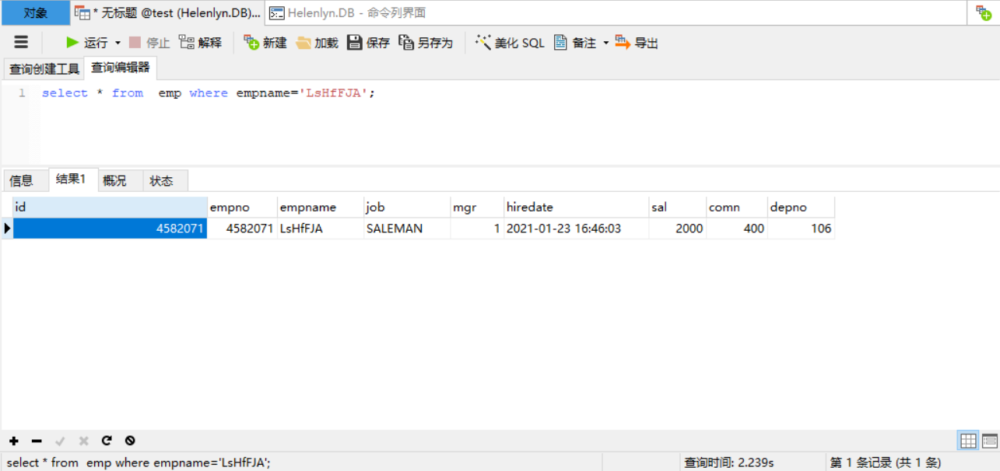
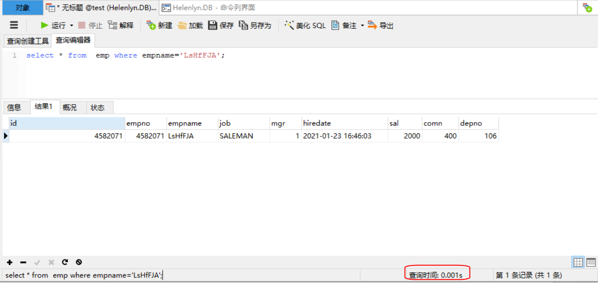

>   

<!-- more -->


## 一、MySQL索引实现

在学习索引之前先了解[B+树的实现原理]()。

我们知道，MySQL内部索引是由不同的引擎实现的，主要包含InnoDB和MyISAM这两种，并且这两种引擎中的索引都是使用b+树的结构来存储的。

### （一）InnoDB引擎中的索引

InnoDB中有2种索引：主键索引（也叫聚集索引）、辅助索引（也叫非聚集索引）。

**1、主键索引**：每个表只有一个主键索引，b+树结构，叶子节点存储主键的值以及对应整条记录的数据，非叶子节点不存储记录的数据，只存储主键的值。

当表中未指定主键时，MySQL内部会自动给每条记录添加一个隐藏的rowid字段（默认4个字节）作为主键，用rowid构建聚集索引。聚集索引在MySQL中即主键索引。

**2、辅助索引**：每个表可以有多个辅助索引，b+树结构，非聚集索引叶子节点存储字段（索引字段）的值以及对应记录主键的值，其他非叶子节点只存储字段的值（索引字段），这就是与聚集索引不同的地方。每个表可以有多个非聚集索引。

MySQL中非聚集索引进一步区分：

| 非聚集索引类型       | 说明                               |
| -------------------- | ---------------------------------- |
| 单列索引             | 一个索引只包含一个列               |
| 多列索引（复合索引） | 一个索引包含多个列                 |
| 唯一索引             | 索引列的值必须唯一，允许有一个空值 |

### （二）MyISAM引擎中的索引

也是B+树结构，MyISM使用的是非聚簇索引，如下图，非聚簇索引的两棵B+树看上去没什么不同，节点的结构完全一致只是存储的内容不同而已：

- 主键索引B+树的节点存储了主键，
- 辅助键索引B+树存储了辅助键。

表数据存储在独立的地方，这两颗B+树的叶子节点都使用一个地址指向真正的表数据，对于表数据来说，这两个键没有任何差别。

由于索引树是独立的，通过辅助键检索无需访问主键的索引树。

下图更形象说明这两种索引的区别，这边假设了一个存储4行数据的表。Id为主键索引，Name作为辅助索引，图中清晰的体现了聚簇索引和非聚簇索引的差异。


 

我们来分析一下图中数据检索过程：

### （三）InnoDB数据检索过程

上面的表中有2个索引：id作为主键索引，name作为辅助索引。

如果需要查询id=14的数据，只需要在左边的主键索引中检索就可以了。

如果需要搜索name='Ellison'的数据，需要2步：

1、先在辅助索引中检索到name='Ellison'的数据，获取id为14

2、再到主键索引中检索id为14的记录

辅助索引这个查询过程在mysql中叫做==回表==，相对于主键索引多了第二步操作。

### （四）MyISAM数据检索过程

1、在索引中找到对应的关键字，获取关键字对应的记录的地址

2、通过记录的地址查找到对应的数据记录

对比发现：InnoDB中最好是采用主键查询，这样只需要一次索引，如果使用辅助索引检索，涉及多一步的回表操作，比主键查询要耗时一些。

### （五）InnoDB中辅助索引区别于MyISAM的是 :star:

表中的数据发生变更的时候，会影响其他记录地址的变化，如果辅助索引中记录数据的地址，此时会受影响，而主键的值一般是很少更新的，当页中的记录发生地址变更的时候，对辅助索引是没有影响的。


## 二、索引管理和使用

### （一）数据准备

请参考第21篇（MySQL全面瓦解21（番外）：一次深夜优化亿级数据分页的奇妙经历）中模拟的千万数据，我们以这个数据为测试数据。

### （二）创建索引

**create 方式：**

```sql
# 单值索引
create [unique] index index_name on t_name(c_name[(length)]); 
# 复合索引
create index index_name on t_name(c_name1[(length)],c_name2[(length)],...); 
```

**alter表 方式：**

```sql
# 单值索引
alter table t_name add [unique] index index_name(c_name[(length)]); 
# 复合索引
alter table t_name add index index_name(c_name1[(length)],c_name2[(length)],...); 
```

这边需注意的是：

index_name 代表索引名称、t_name代表 表名称、c_name代表字段名称。

[] 中括号的内容是可以省略的，也就是说 unique 和 length 可以不写。如果加上了unique，表示创建唯一索引。

如果字段是char、varchar类型，length可以小于字段实际长度，如果是blog、text等长文本类型，必须指定length。

如果t_name后面只写一个字段，就是单列索引，如果需要写多个字段，可以使用逗号隔开，这种叫做复合索引。

### （三）删除索引

```sql
drop index index_name on t_name;
```


### （四）查看索引

```sql
show index from t_name; 
```


### （五）索引修改

即先删除索引，再重建索引：drop +create。

### （六）示例

emp表中有500W数据 我们用emp来做测试

```sql
 mysql> select count(*) from emp;
 +----------+
 | count(*) |
 +----------+
 |  5000000 |
 +----------+
 1 row in set 
```

查看和创建索引

记得我们之前在emp表上做过索引，所以先看一下这个表目前所有的索引

可以看到，目前主键字段id和depno字段上都有建立索引

```sql
 mysql> desc emp;
 +----------+-----------------------+------+-----+---------+----------------+
 | Field    | Type                  | Null | Key | Default | Extra          |
 +----------+-----------------------+------+-----+---------+----------------+
 | id       | int(10) unsigned      | NO   | PRI | NULL    | auto_increment |
 | empno    | mediumint(8) unsigned | NO   |     | 0       |                |
 | empname  | varchar(20)           | NO   |     |         |                |
 | job      | varchar(9)            | NO   |     |         |                |
 | mgr      | mediumint(8) unsigned | NO   |     | 0       |                |
 | hiredate | datetime              | NO   |     | NULL    |                |
 | sal      | decimal(7,2)          | NO   |     | NULL    |                |
 | comn     | decimal(7,2)          | NO   |     | NULL    |                |
 | depno    | mediumint(8) unsigned | NO   | MUL | 0       |                |
 +----------+-----------------------+------+-----+---------+----------------+
 9 rows in set
 
 mysql> show index from emp;
 +-------+------------+---------------+--------------+-------------+-----------+-------------+----------+--------+------+------------+---------+---------------+
 | Table | Non_unique | Key_name      | Seq_in_index | Column_name | Collation | Cardinality | Sub_part | Packed | Null | Index_type | Comment | Index_comment |
 +-------+------------+---------------+--------------+-------------+-----------+-------------+----------+--------+------+------------+---------+---------------+
 | emp   |          0 | PRIMARY       |            1 | id          | A         |     4952492 | NULL     | NULL   |      | BTREE      |         |               |
 | emp   |          1 | idx_emp_id    |            1 | id          | A         |     4952492 | NULL     | NULL   |      | BTREE      |         |               |
 | emp   |          1 | idx_emp_depno |            1 | depno       | A         |          18 | NULL     | NULL   |      | BTREE      |         |               |
 +-------+------------+---------------+--------------+-------------+-----------+-------------+----------+--------+------+------------+---------+---------------+
 3 rows in set
```

我们在没有做索引的字段上做一下查询看看，在500W数据中查询一个名叫LsHfFJA的员工，消耗 2.239S



再看看他的执行过程，扫描了4952492 条数据才找到该行数据：

```sql
mysql> explain select * from emp where empname='LsHfFJA';
+----+-------------+-------+------+---------------+------+---------+------+---------+-------------+
| id | select_type | table | type | possible_keys | key  | key_len | ref  | rows    | Extra       |
+----+-------------+-------+------+---------------+------+---------+------+---------+-------------+
|  1 | SIMPLE      | emp   | ALL  | NULL          | NULL | NULL    | NULL | 4952492 | Using where |
+----+-------------+-------+------+---------------+------+---------+------+---------+-------------+
1 row in set
```

我们在empname这个字段上建立索引

```sql
mysql> create index idx_emp_empname on emp(empname); 
Query OK, 0 rows affected
Records: 0  Duplicates: 0  Warnings: 0

mysql> show index from emp;
+-------+------------+-----------------+--------------+-------------+-----------+-------------+----------+--------+------+------------+---------+---------------+
| Table | Non_unique | Key_name        | Seq_in_index | Column_name | Collation | Cardinality | Sub_part | Packed | Null | Index_type | Comment | Index_comment |
+-------+------------+-----------------+--------------+-------------+-----------+-------------+----------+--------+------+------------+---------+---------------+
| emp   |          0 | PRIMARY         |            1 | id          | A         |     4952492 | NULL     | NULL   |      | BTREE      |         |               |
| emp   |          1 | idx_emp_id      |            1 | id          | A         |     4952492 | NULL     | NULL   |      | BTREE      |         |               |
| emp   |          1 | idx_emp_depno   |            1 | depno       | A         |          18 | NULL     | NULL   |      | BTREE      |         |               |
| emp   |          1 | idx_emp_empname |            1 | empname     | A         |     1650830 | NULL     | NULL   |      | BTREE      |         |               |
+-------+------------+-----------------+--------------+-------------+-----------+-------------+----------+--------+------+------------+---------+---------------+
4 rows in set 
```

再看一下这个执行效率，就会发现有质的飞跃：0.001S，就是这么神奇，学过之前那篇的B+ Tree就知道，它不用从头开始扫表核对，而是很少次数的io读取



 

再看看他的执行过程，一次定位到该条数据：

```sql
mysql> explain select * from emp where empname='LsHfFJA';
+----+-------------+-------+------+-----------------+-----------------+---------+-------+------+-----------------------+
| id | select_type | table | type | possible_keys   | key             | key_len | ref   | rows | Extra                 |
+----+-------------+-------+------+-----------------+-----------------+---------+-------+------+-----------------------+
|  1 | SIMPLE      | emp   | ref  | idx_emp_empname | idx_emp_empname | 22      | const |    1 | Using index condition |
+----+-------------+-------+------+-----------------+-----------------+---------+-------+------+-----------------------+
1 row in set
```

### （七）设置合适的索引长度

根据我们之前的了解，每个磁盘块（disk）存储的内容是有限的，如果一个页中可以存储的索引记录越多，那么查询效率就会提高，所以我们可以指定索引的字段长度。

但并不是越短越好，要保证字符类型字段查询有足够高的区分度，如果只设置了一个长度，反而导致查询的相似匹配度不高。

长度的原则是要恰到好处，太长索引文件就会变大，因此要在区分度和长度上做一个平衡。

如果在我们搜索的内容中，最后的内容是一致的或者高度一致的，那我们就可以省略，比如在用户的email字段上做索引，几乎前10个字符是不一样的，结尾限定在 `@****`，那么通过前面10个字符就可以定位一个email地址了。

我们在该字段创建索引的时候就可以指定长度为10，这样相对于整个email字段更短些，查询效果确却基本一样，这样一个页中也可以存储更多的索引记录。

像我们上面的那个 empname 字段，基本都是6位数的，只是小部分是超过6位数，而且后缀基本一致，所以6位数之后的区分度差不多。

有一个判断 高区分度以及合适长度索引 的通用算法，如下：

```sql
1 select count(distinct left(`c_name`,calcul_len))/count(*) from t_name;
```

下面是对 empname 做的分析，匹配度越高搜索效率越高：

```sql
mysql> select count(distinct left(`empname`,3))/count(*) from emp;
+--------------------------------------------+
| count(distinct left(`empname`,3))/count(*) |
+--------------------------------------------+
| 0.0012                                     |
+--------------------------------------------+
1 row in set

mysql> select count(distinct left(`empname`,4))/count(*) from emp;
+--------------------------------------------+
| count(distinct left(`empname`,4))/count(*) |
+--------------------------------------------+
| 0.0076                                     |
+--------------------------------------------+
1 row in set

mysql> select count(distinct left(`empname`,6))/count(*) from emp;
+--------------------------------------------+
| count(distinct left(`empname`,6))/count(*) |
+--------------------------------------------+
| 0.1713                                     |
+--------------------------------------------+
1 row in set

mysql> select count(distinct left(`empname`,7))/count(*) from emp;
+--------------------------------------------+
| count(distinct left(`empname`,7))/count(*) |
+--------------------------------------------+
| 0.1713                                     |
+--------------------------------------------+
1 row in set
```

